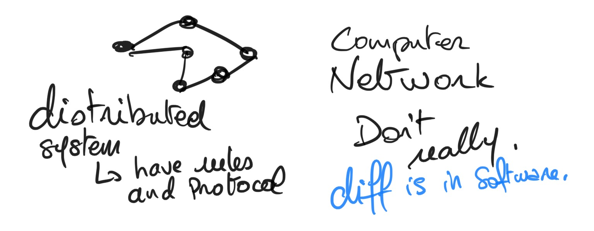
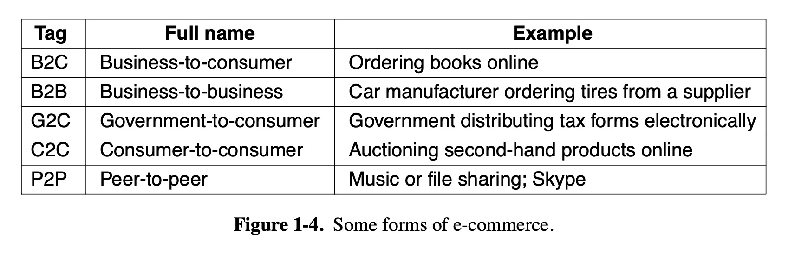

Computer Networks

Chapter 1

> Throughout the book we will use the term ''computer network'' to mean a collection of autonomous computers interconnected by a single technology.

> Although it may sound strange to some people, neither the Internet nor the World Wide Web is a computer network. By the end of this book, it should be clear why. The quick answer is: the Internet is not a single network but a network of networks and the Web is a distributed system that runs on top of the Internet.

> There is considerable confusion in the literature between a computer network and a distributed system. The key distinction is that in a distributed system, a collection of independent computers appears to its users as a single coherent system. Usually, it has a single model or paradigm that it presents to the users. Often a layer of software on top of the operating system, called middleware, is responsible for implementing this model.

> In a computer network, this coherence, model, and software are absent. Users are exposed to the actual machines, without any attempt by the system to make the machines look and act in a coherent way. If the machines have different hardware and different operating systems, that is fully visible to the users. If a user
wants to run a program on a remote machine, he has to log onto that machine and run it there.

> In effect, a distributed system is a software system built on top of a network. The software gives it a high degree of cohesiveness and transparency. Thus, the distinction between a network and a distributed system lies with the software (especially the operating system), rather than with the hardware.

1.1.1 Business Applications

> However, probably even more important than sharing physical resources such as printers, scanners, and CD burners, is sharing information
> In other words, the mere fact that a user happens to be 15,000 km away from his data should not prevent him from using the data as though they were local. This goal may be summarized by saying that it is an attempt to end the ''tyranny of geography.''

6th edition

> Online publishing and content curation on social media platforms supports a funding model that depends largely on highly targeted behavioral advertising, which necessarily implies gathering data about the behavior of individual users. This information has sometimes been misused.

Popular models for abstracting network are client server, peer to peer (where there is no fixed division into clients and servers)

> Many peer-to-peer systems, such as BitTorrent (Cohen, 2003), do not have a central database of content. Instead, each user maintains a local database of con- tent, as well as a list of other members of the system. A new user can then go to any existing member to see what he has and get the names of other members to inspect for more content and more names. This lookup process can be repeated indefinitely to build up a large local database of what is out there. It is an activity that would get tedious for people, but computers excel at it.

1.1.2 Person-to-Person Communication

> Person-to-person communication is the 21st century’s answer to the 19th cen- tury’s telephone.

> Many Internet users now rely on some form of instant messaging to commun- icate with other people on the Internet. This facility, derived from the UNIX talk program in use since around 1970, allows two people to type messages at each other in real time.

> In the long run, the use of networks to enhance human-to-human communication may prove more important than any of the others

1.1.3 Electronic Commerce

