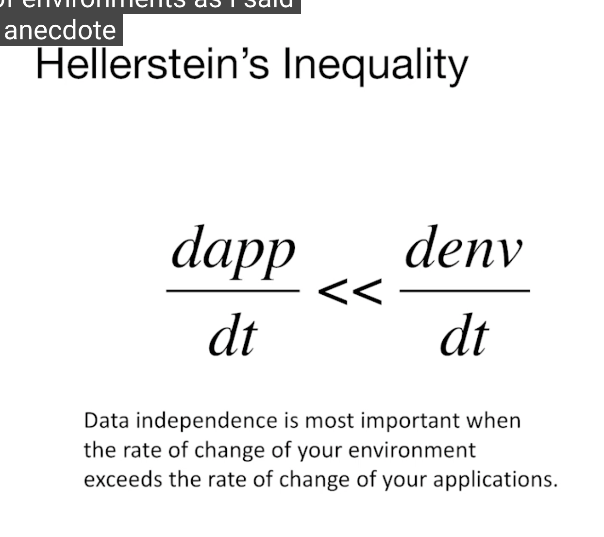

# -

- logical data independance: is the fact that view stay the same even if you change your conceptual schema

- physical independance: is the fact the retreiving data stay the same even if you change your physical data, ie add un index(b-tree)

