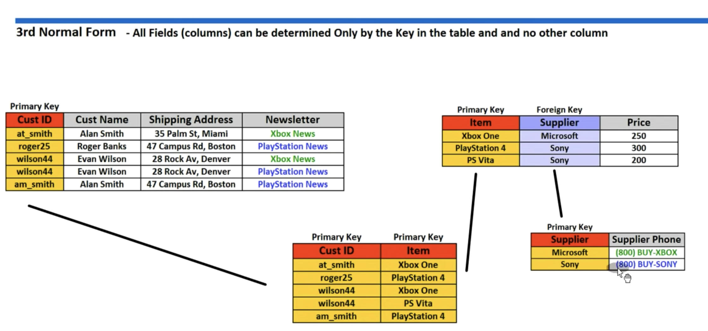
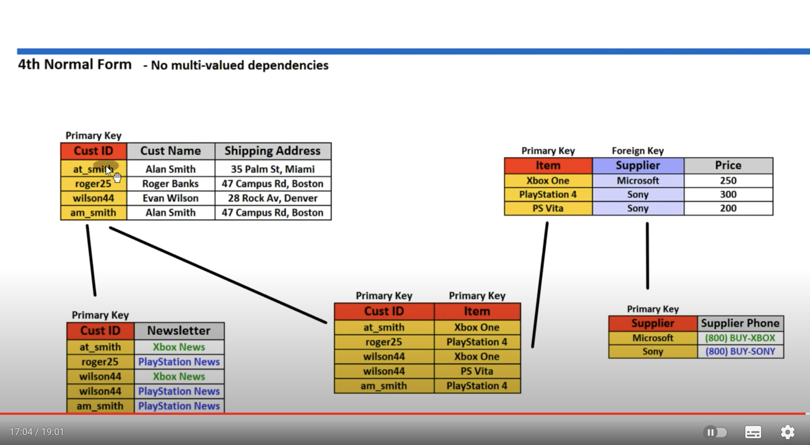
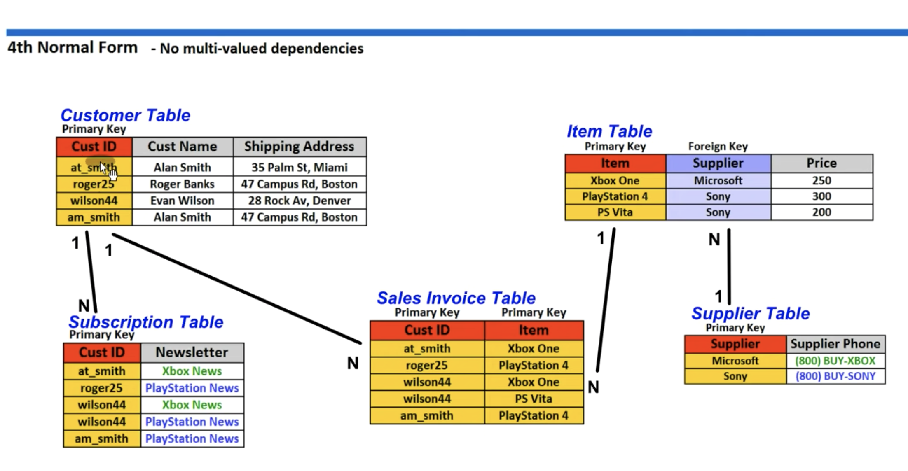

# Normalization

## 1st Normal Form

- each cell has to be single value
- entries in a column are th same type
- Rows are unique, unique id or enough number of rows that make it unique

## 2nd Normal Form

- All attributes (non-keys column) dependant on the key

ie all the columns that stay the same, on different key

coumpound key

## 3nd normal form

All field can be determined by the key

## 4nd normal form

No multi-valued dependancy

