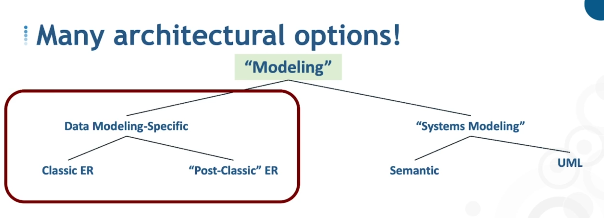
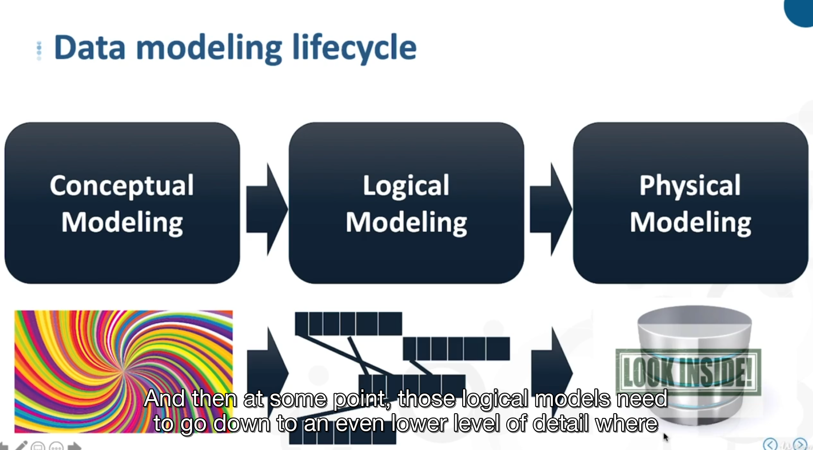
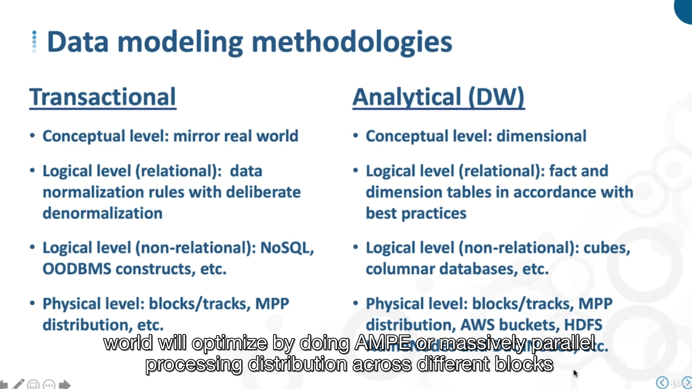

# Approach

## -

- classic ER - chen 1976, also extended ER
  - made up of the classic Entity Relation Box, and also other construct in extended ER
- Post classic ER, Crows foot
Very similar semantically, but differents notation

- System modeling
  - semantic IEDF1X
  - IDEF0 (functions) and IDEF2(dynamics)

- UML, object oriented system, general purpose modeling languages and notation for software engineering , adopted by the Object Management Group (OMG) as standard

## -

is data modeling the same as database design ?

### database design

Database design - designing a databasem tied to a specific DBMS(relation or non relational)
DBMS (Data Base Management System) - SGBD (Système de Gestion de Base de Données)

physical storage, index, partitioning etc

So in database design we take thoses restrictions fron the very beginning

### data modeling

start conceptually, semantic level

non constraint to implementation rules

closer to real world than database design

### data modeling for transactional environment vs analytical

