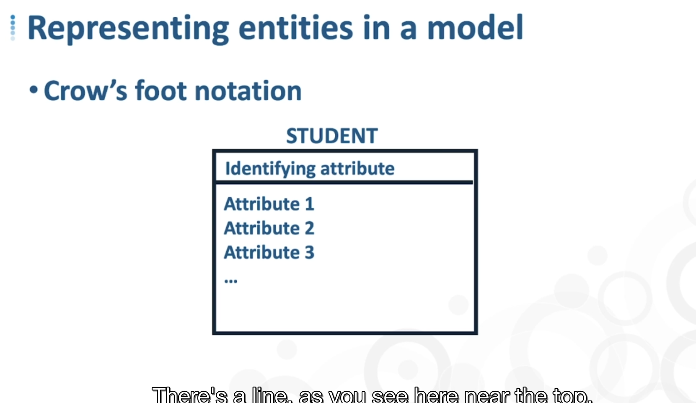
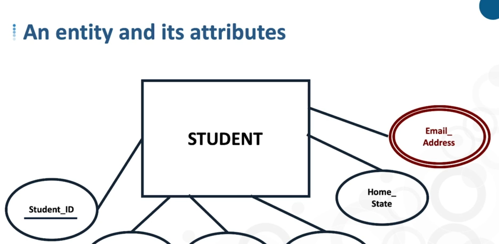
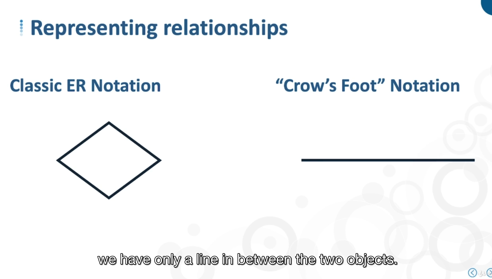
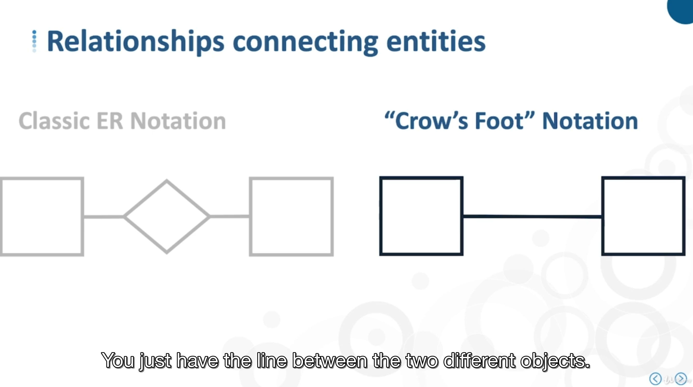
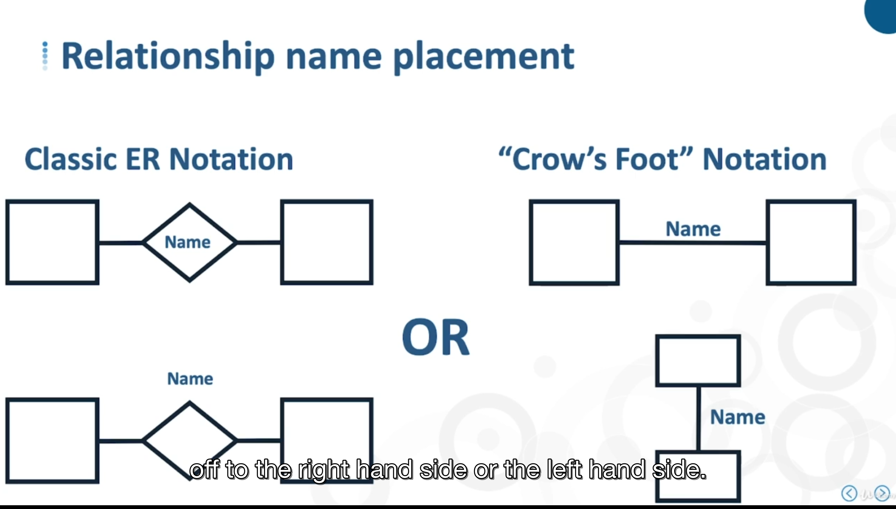

#

## - Entities

Normal / real entity have squared corners

- classic ER, name are in the box, attributes are in the box
- Crows foot notation

weak entity can have rouaded corners

## - Attributes

Attributes have description & rules

- Data types and sizes
- Whether NULL values are allowed
- Permissibles values
- attributes constraints

(attributes domain set of attributes)

MVA (multi value attribute), example an user can have multiple emails,

in corws notation, it's can be identitfied by an {{attributes}} in curlu bracess

## Relationship

Single naming, only one way link, double naming, double verbs
