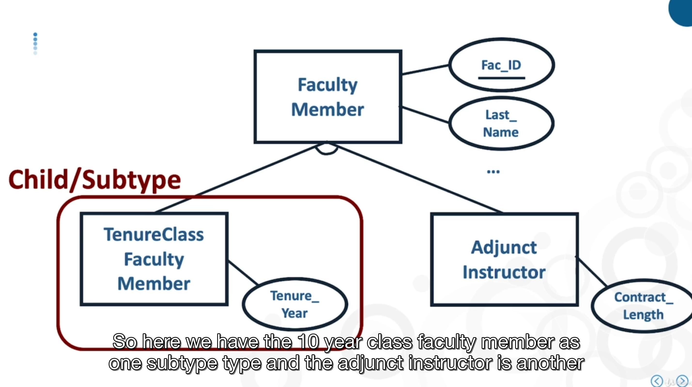
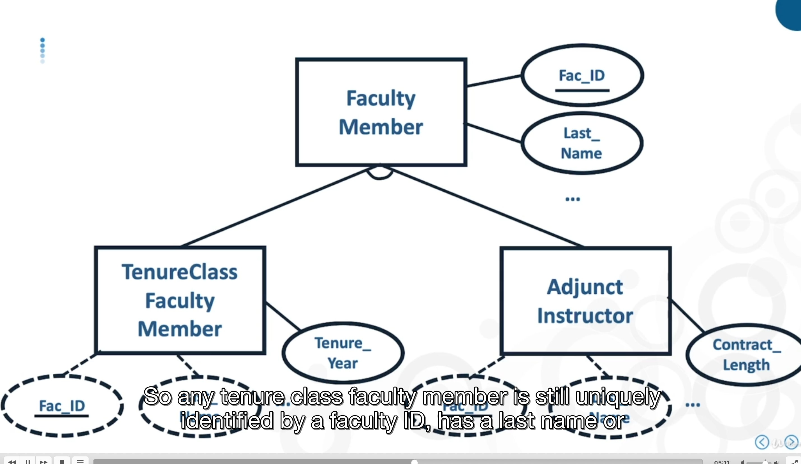
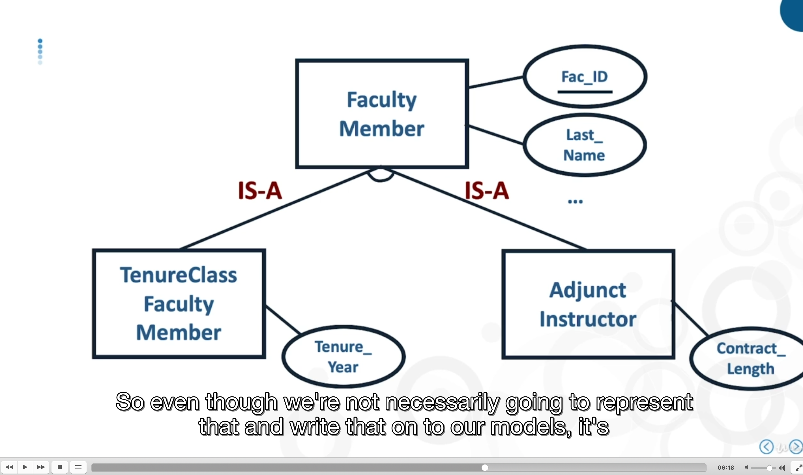
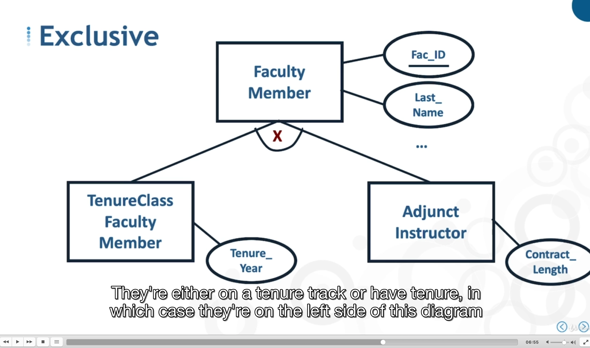
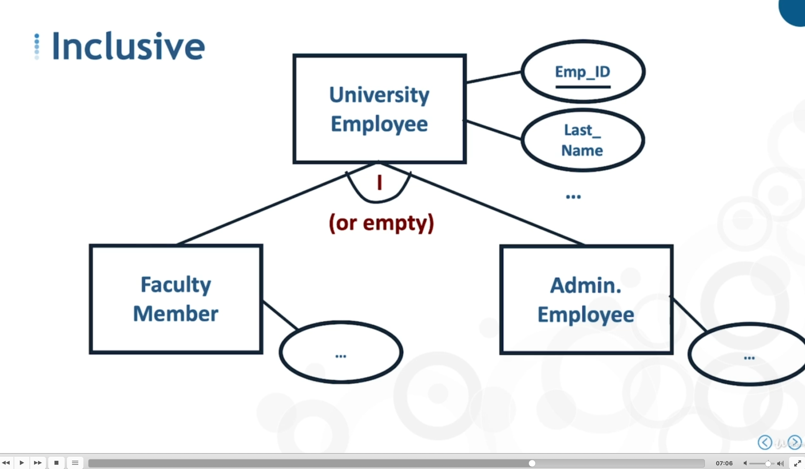
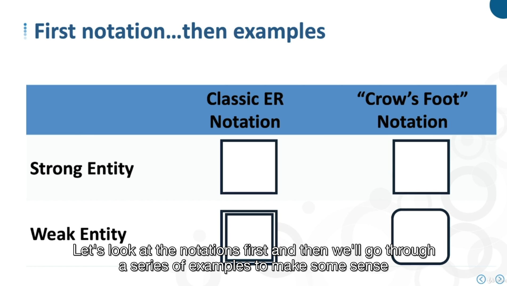
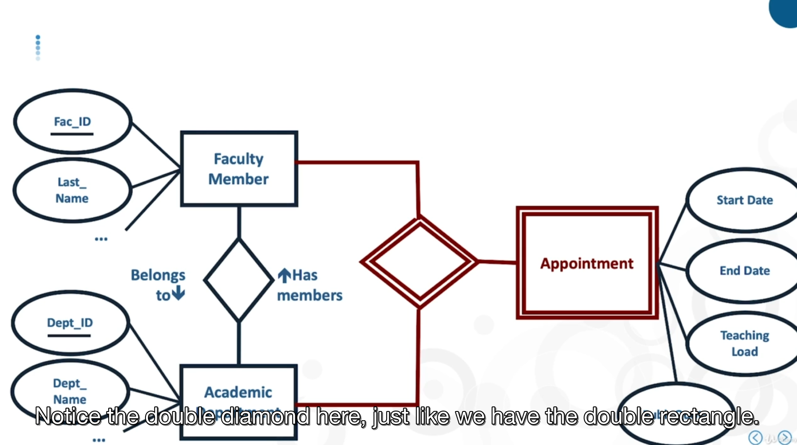
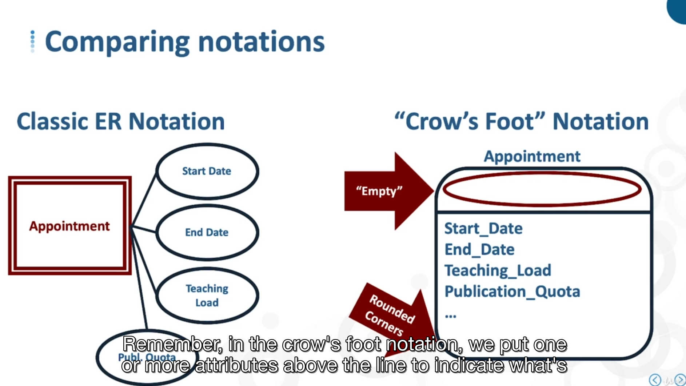

# -

hierarchie are kind a entity and a relationship

specialiszation

hierarchie can be inclusive or exclusive, an either or an or

We can also have multi-level hierachie, nested

## - constraint

for attributes

- Data-types and size
- Null allowed
- permissable values (range of value or enum)

## - Strong vs weak entities

- strong vs weak entities
- strong vs weak relationship
- independent vs dependent enetities
- existence dependency vs identification dependency

