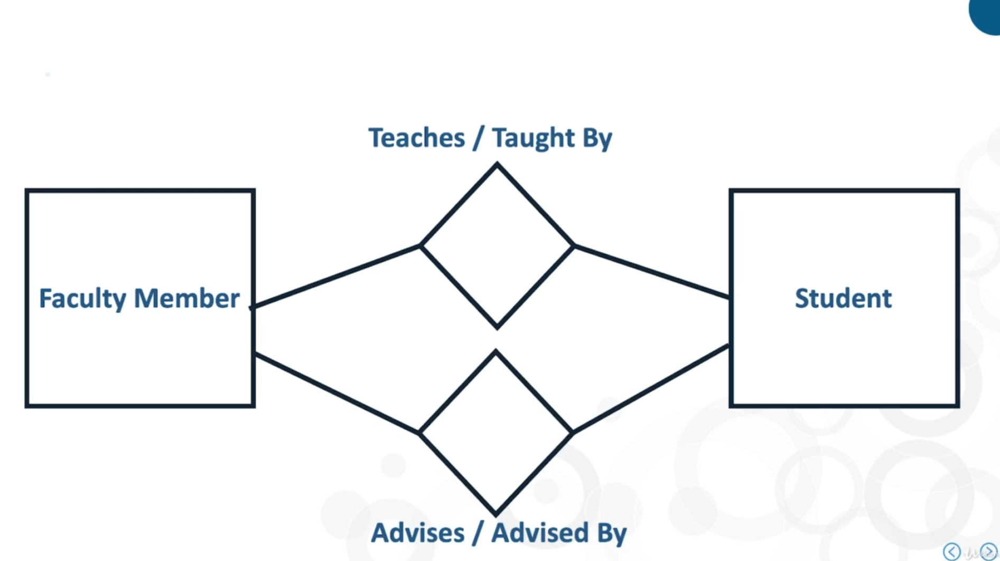
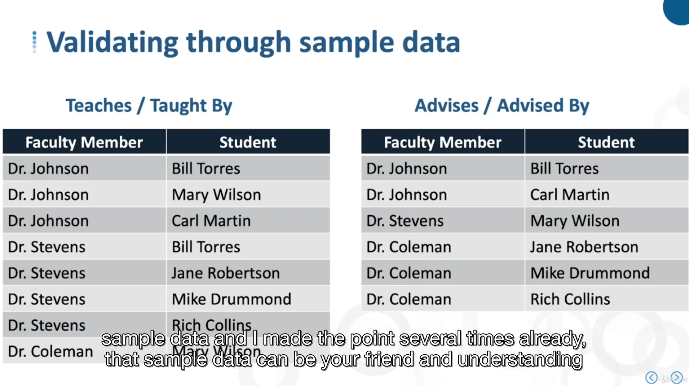
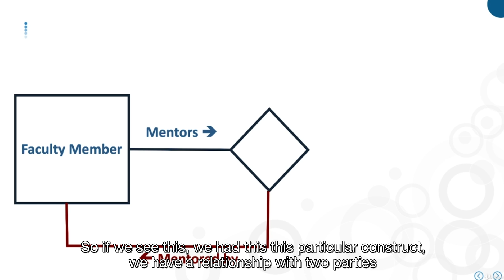
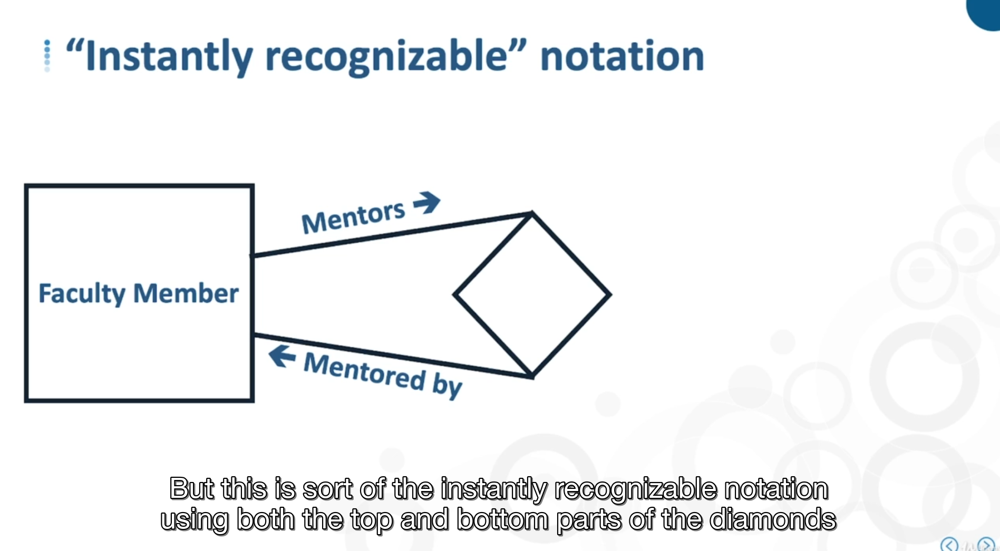
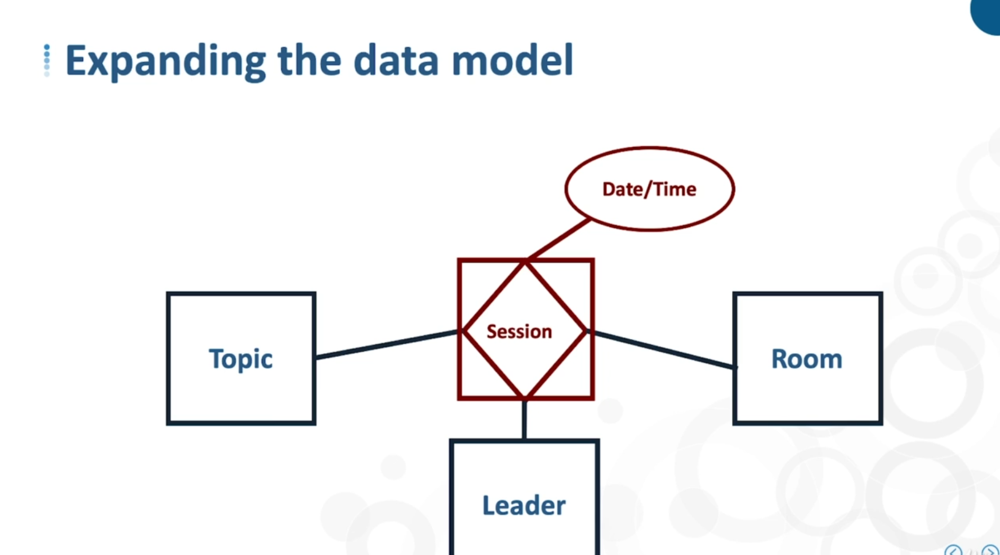
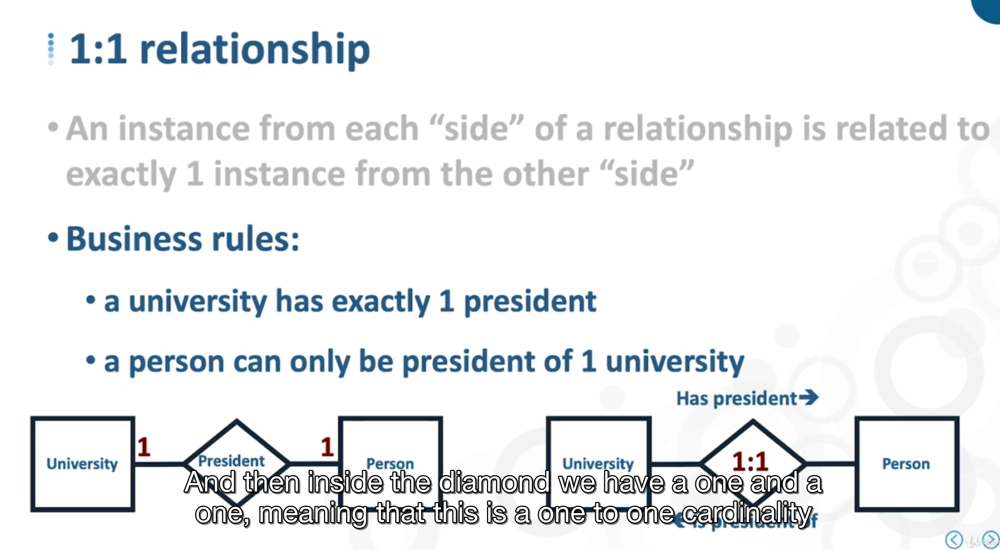
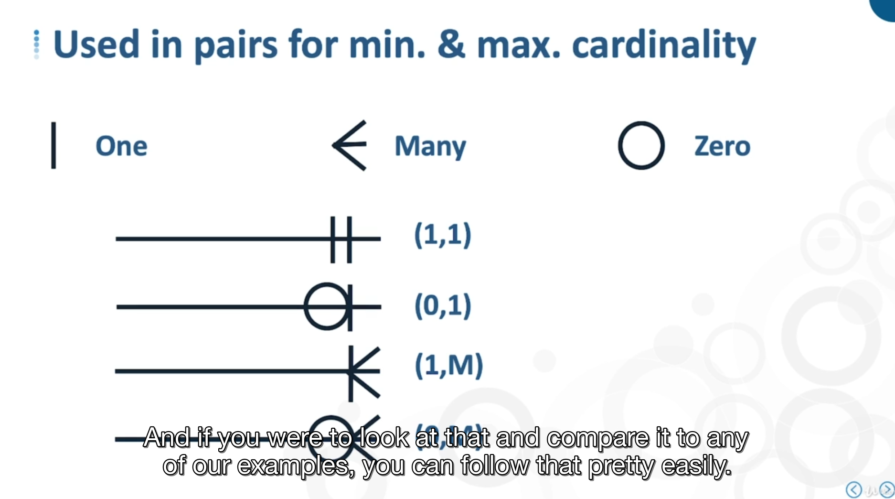
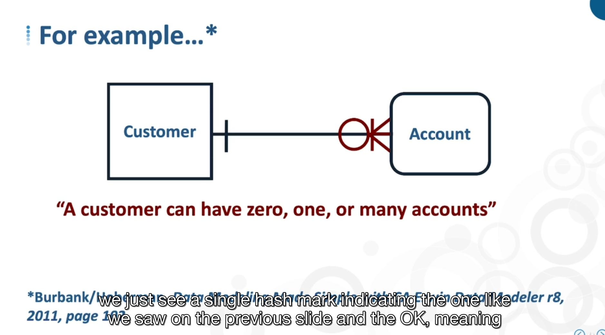

# -

multiple relatioship, recursive, ternary

- multiple relationship
  - multiple verbs to link relationship
    - 
    - 
- recursive
  - 
  - 
- ternary
  - 
- gerunds
  - attributes that are specific to the relationship itself
  - 

## cardinality

It's part of explicit representation of business rules

maximum cardinality, minimum cardinality

maximum cardinality, 1 OR M(MANY), can be a specific number value. Bidirectional naming can help making thoses

- 1:1, an instance from each side of the relationship is related ti excatly 1 instance from the other "side"

- 1:M, an instance from one side of the relationship is related to 1 or more instances from the other side

- M:M or M:N

## Crows foot notation

