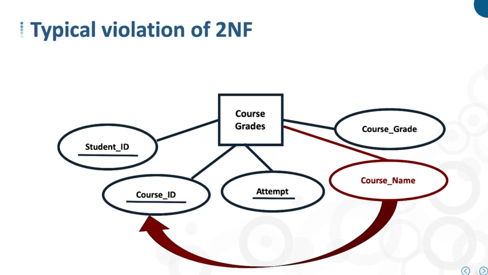
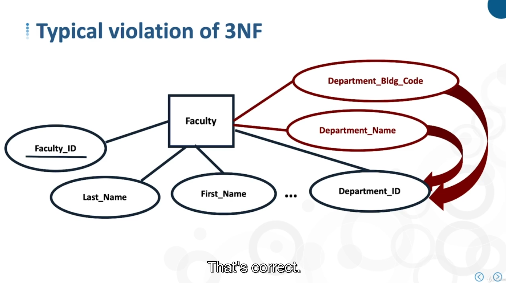

# -

## normalization

applies to RDBMS, 1970 Edgar Codd

he defined 1st, 2nd and 3rd normal form

> the key, the whole key & nothing but the key

## 1 nromal form

Every row must be unique, no repeating groups, ie MVA no

## 2 nromal form

no partial key dependencies

## 3 normal form

no non key dependencies

## conceptual to logical

- Address violations of normalization
    - -
- Transform M:M relationship
    - -
- Add foreign key
    - -

04 - redo

05 maybe
