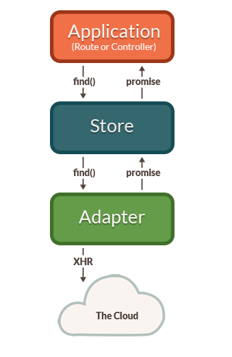

# Ember data

Ember developers have great options for how they handle data from back end APIs. Ember itself works with any type of back end: REST, JSON:API, GraphQL, or anything else.

Many developers choose to use Ember Data, a powerful set of tools for formatting requests, normalizing responses, and efficiently managing a local cache of data. The Ember Data library is included by default for applications generated with the Ember CLI; however, if you do not wish to use it, it can easily be removed by removing the ember-data entry from package.json. Some developers write all their own code to handle API requests, using native JavaScript methods like fetch or third-party libraries. Many apps use a combination of approaches.

## What are Ember Data models?

Models tend to be persistent. That means the user does not expect model data to be lost when they close their browser window. To make sure no data is lost, if the user makes changes to a model, you need to store the model data somewhere that it will not be lost.

Typically, most models are loaded from and saved to a server that uses a database to store data. Usually you will send JSON representations of models back and forth to an HTTP server that you have written. However, Ember makes it easy to use other durable storage, such as saving to the user's hard disk with IndexedDB, or hosted storage solutions that let you avoid writing and hosting your own servers.

At first, using Ember Data may feel different than the way you're used to writing JavaScript applications. Many developers are familiar with using Ajax to fetch raw JSON data from an endpoint, which may appear easy at first. Over time, however, complexity leaks out into your application code, making it hard to maintain.

With Ember Data, managing models as your application grows becomes both simpler and easier.

Once you have an understanding of Ember Data, you will have a much better way to manage the complexity of data loading in your application. This will allow your code to evolve and grow, with better maintainability.

## Ember Data flexibility

## The Store and a Single Source of Truth

One common way of building web applications is to tightly couple user interface elements to data fetching.

You might be tempted to make the component responsible for fetching that data and storing it, however it's not really reuasble

Ember approach: Ember Data gives you a single store that is the central repository of models in your application. Routes and their corresponding controllers can ask the store for models, and the store is responsible for knowing how to fetch them.

It also means that the store can detect that two different components are asking for the same model, allowing your app to only fetch the data from the server once. You can think of the store as a read-through cache for your app's models. Both routes and their corresponding controllers have access to this shared store; when they need to display or modify a model, they first ask the store for it.

> ***Ember Data injects the store service in every route and controller, so you can access it as `this.store`!***

## Models

```js
import DS from 'ember-data';

export default DS.Model.extend({
  firstName: DS.attr('string'),
  birthday:  DS.attr('date')
});
```

```js
import DS from 'ember-data';

export default DS.Model.extend({
  lineItems: DS.hasMany('line-item')
});
```

```js
import DS from 'ember-data';

export default DS.Model.extend({
  order: DS.belongsTo('order')
});
```

## Records

A record is an instance of a model

A record is uniquely identified by its model type and ID.

For example, if you were writing a contact management app, you might have a Person model. An individual record in your app might have a type of person and an ID of 1 or steve-buscemi.

An ID is usually assigned to a record by the server when you save it for the first time, but you can also generate IDs client-side.

## Adapter

## Caching

The store will automatically cache records for you. If a record had already been loaded, asking for it a second time will always return the same object instance. This minimizes the number of round-trips to the server, and allows your application to render its UI to the user as fast as possible.

One downside to returning a cached record is you may find the state of the data has changed since it was first loaded into the store's identity map. In order to prevent this stale data from being a problem for long, Ember Data will automatically make a request in the background each time a cached record is returned from the store. When the new data comes in, the record is updated, and if there have been changes to the record since the initial render, the template is re-rendered with the new information.

## Architecture Overview

The first time your application asks the store for a record, the store sees that it doesn't have a local copy and requests it from your adapter. Your adapter will go and retrieve the record from your persistence layer; typically, this will be a JSON representation of the record served from an HTTP server.



Because of this asynchronicity, the store immediately returns a promise from the findRecord() method. Similarly, any request that the store makes to the adapter also returns promises.

Once the request to the server returns with a JSON payload for the requested record, the adapter resolves the promise it returned to the store with the JSON.

The store then takes that JSON, initializes the record with the JSON data, and resolves the promise returned to your application with the newly-loaded record.


Let's look at what happens if you request a record that the store already has in its cache.


In this case, because the store already knew about the record, it returns a promise that it resolves with the record immediately. It does not need to ask the adapter (and, therefore, the server) for a copy since it already has it saved locally.