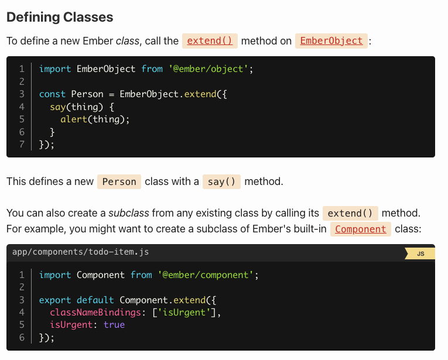
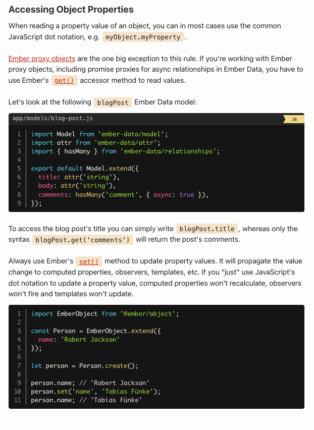

# Classes and Instances



## Overriding Parent Class Methods

When defining a subclass, you can override methods but still access the implementation of your parent class by calling the special _super() method:

```js
import EmberObject from '@ember/object';

const Person = EmberObject.extend({
  say(thing) {
    alert(`${this.name} says: ${thing}`);
  }
});

const Soldier = Person.extend({
  say(thing) {
    // this will call the method in the parent class (Person#say), appending
    // the string ', sir!' to the variable `thing` passed in
    this._super(`${thing}, sir!`);
  }
});

let yehuda = Soldier.create({
  name: 'Yehuda Katz'
});

yehuda.say('Yes'); // alerts "Yehuda Katz says: Yes, sir!"
```

## Initializing Instances

When a new instance is created, its init() method is invoked automatically. This is the ideal place to implement setup required on new instances:

```js
import EmberObject from '@ember/object';

const Person = EmberObject.extend({
  init() {
    alert(`${this.name}, reporting for duty!`);
  }
});

Person.create({
  name: 'Stefan Penner'
});

// alerts "Stefan Penner, reporting for duty!"
```

If you are subclassing a framework class, like `Ember.Component`, and you override the `init()` method, make sure you call `this._super(...arguments)`! If you don't, a parent class may not have an opportunity to do important setup work, and you'll see strange behavior in your application.

**Arrays and objects defined directly on any `Ember.Object` are shared across all instances of that class.**

```js

import { A } from '@ember/array';
import EmberObject from '@ember/object';

const Person = EmberObject.extend({
  shoppingList: A(['eggs', 'cheese'])
});

Person.create({
  name: 'Stefan Penner',
  addItem() {
    this.shoppingList.pushObject('bacon');
  }
});

Person.create({
  name: 'Robert Jackson',
  addItem() {
    this.shoppingList.pushObject('sausage');
  }
});

// Stefan and Robert both trigger their addItem.
// They both end up with: ['eggs', 'cheese', 'bacon', 'sausage']
```

To avoid this behavior, it is encouraged to initialize those arrays and object properties during `init()`. Doing so ensures each instance will be unique.

```js
import { A } from '@ember/array';
import EmberObject from '@ember/object';

const Person = EmberObject.extend({
  init() {
    this.set('shoppingList', A(['eggs', 'cheese']));
  }
});

Person.create({
  name: 'Stefan Penner',
  addItem() {
    this.shoppingList.pushObject('bacon');
  }
});

Person.create({
  name: 'Robert Jackson',
  addItem() {
    this.shoppingList.pushObject('sausage');
  }
});

// Stefan ['eggs', 'cheese', 'bacon']
// Robert ['eggs', 'cheese', 'sausage']
```



**Always use Ember's [`set()`](https://api.emberjs.com/ember/3.12/classes/@ember%2Fobject/methods/set?anchor=set) method to update property values. It will propagate the value change to computed properties, observers, templates, etc. If you "just" use JavaScript's dot notation to update a property value, computed properties won't recalculate, observers won't fire and templates won't update.**
