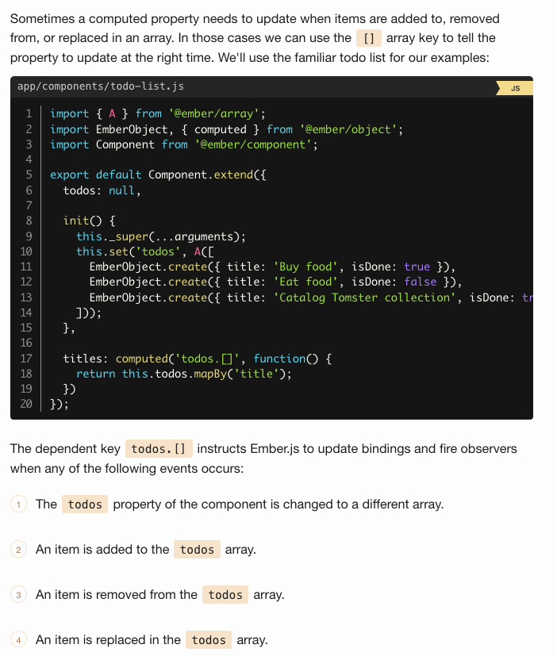
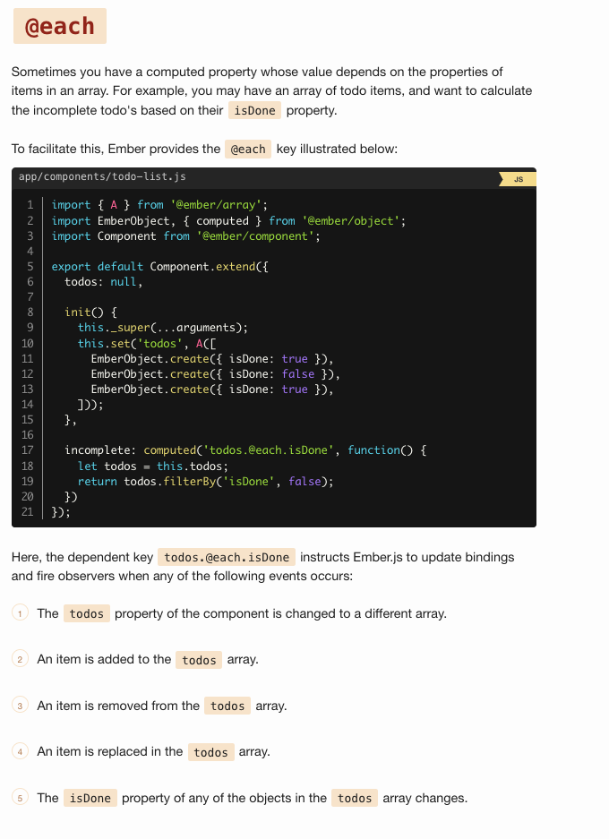

# computed-properties-and-aggregate-data

When a computed property depends on the contents of an array, there are a few extra methods you'll need to use in order to correctly recognize when the contents of the array change. Arrays have two special keys you can append to array properties to track changes on them, `[]` and `@each`.

## [ ]

Notably, the computed property will not update if an individual todo is mutated. For that to happen, we need to use the special `@each` key.

## @each

It's important to note that the `@each` key can be dependent on more than one key. For example, if you are using `Ember.computed` to sort an array by multiple keys, you would declare the dependency with braces: `todos.@each.{priority,title}`

## macro filterBy

TODO: finish
<https://guides.emberjs.com/v3.12.0/object-model/computed-properties-and-aggregate-data/#toc_-vs-each>
