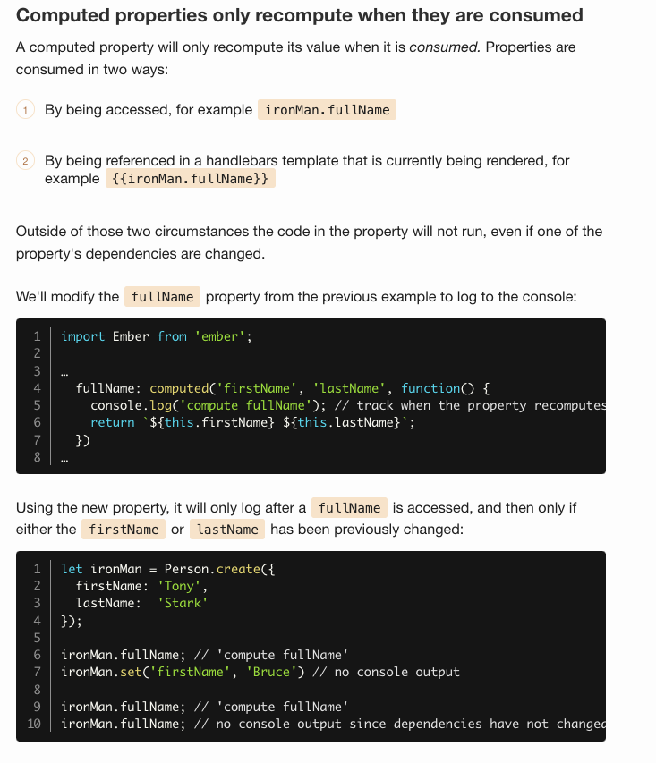
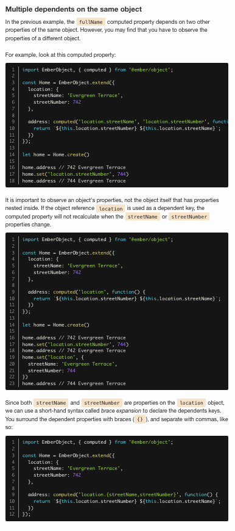

# What are Computed Properties?

In a nutshell, computed properties let you declare functions as properties. You create one by defining a computed property as a function, which Ember will automatically call when you ask for the property. You can then use it the same way you would any normal, static property.

It's super handy for taking one or more normal properties and transforming or manipulating their data to create a new value.

```js
import EmberObject, { computed } from '@ember/object';

Person = EmberObject.extend({
  // these will be supplied by `create`
  firstName: null,
  lastName: null,

  fullName: computed('firstName', 'lastName', function() {
    return `${this.firstName} ${this.lastName}`;
  })
});

let ironMan = Person.create({
  firstName: 'Tony',
  lastName:  'Stark'
});

ironMan.fullName; // "Tony Stark"
```

This declares `fullName` to be a computed property, with `firstName` and `lastName` as the properties it depends on. The first time you access the `fullName` property, the function will be called and the results will be cached. Subsequent access of `fullName` will read from the cache without calling the function. Changing any of the dependent properties causes the cache to invalidate, so that the computed function runs again on the next access.





`syntax called brace expansion`

## Chaining computed properties

You can use computed properties as values to create new computed properties.

```js
import EmberObject, { computed } from '@ember/object';

Person = EmberObject.extend({
  firstName: null,
  lastName: null,
  age: null,
  country: null,

  fullName: computed('firstName', 'lastName', function() {
    return `${this.firstName} ${this.lastName}`;
  }),

  description: computed('fullName', 'age', 'country', function() {
    return `${this.fullName}; Age: ${this.age}; Country: ${this.country}`;
  })
});

let captainAmerica = Person.create({
  firstName: 'Steve',
  lastName: 'Rogers',
  age: 80,
  country: 'USA'
});

captainAmerica.get('description'); // "Steve Rogers; Age: 80; Country: USA"
```

>logic

## kinda logic -  Dynamic updating[](https://guides.emberjs.com/v3.12.0/object-model/computed-properties/#toc_dynamic-updating)

Computed properties, by default, observe any changes made to the properties they depend on and are dynamically updated when they're called. Let's use computed properties to dynamically update.

```javascript
captainAmerica.set('firstName', 'William');

captainAmerica.description; // "William Rogers; Age: 80; Country: USA"
```

So this change to `firstName` was observed by `fullName` computed property, which was itself observed by the `description` property.

Setting any dependent property will propagate changes through any computed properties that depend on them, all the way down the chain of computed properties you've created.

## computed can also be setter

```js
import EmberObject, { computed } from '@ember/object';

Person = EmberObject.extend({
  firstName: null,
  lastName: null,

  fullName: computed('firstName', 'lastName', {
    get(key) {
      return `${this.firstName} ${this.lastName}`;
    },
    set(key, value) {
      let [firstName, lastName] = value.split(/\s+/);
      this.set('firstName', firstName);
      this.set('lastName',  lastName);
      return value;
    }
  })
});


let captainAmerica = Person.create();
captainAmerica.set('fullName', 'William Burnside');
captainAmerica.firstName; // William
captainAmerica.lastName; // Burnside
```

# Computed property macros

Some types of computed properties are very common. Ember provides a number of computed property macros, which are shorter ways of expressing certain types of computed property.

```js
import EmberObject, { computed } from '@ember/object';
import { equal } from '@ember/object/computed';

Person = EmberObject.extend({
  fullName: 'Tony Stark',

  isIronManLongWay: computed('fullName', function() {
    return this.fullName === 'Tony Stark';
  }),

  isIronManShortWay: equal('fullName', 'Tony Stark')
});
```
