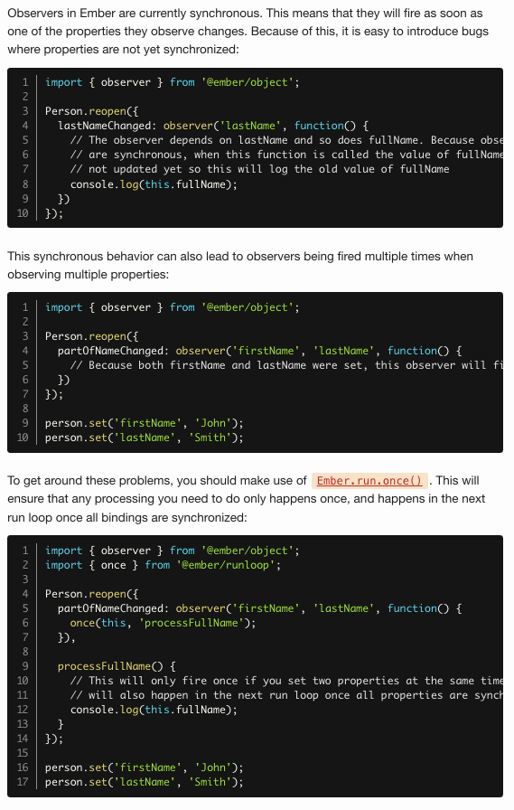
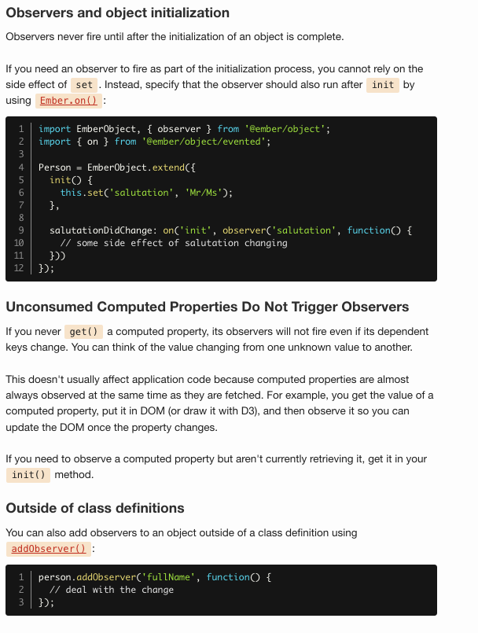

# Observers

> Note: Observers are often over-used by new Ember developers. Observers are used heavily within the Ember framework itself, but for most problems Ember app developers face, computed properties are the appropriate solution.

you can set up an observer on an object by using `observer`:

```js
import EmberObject, {
  computed,
  observer
} from '@ember/object';

Person = EmberObject.extend({
  // these will be supplied by `create`
  firstName: null,
  lastName: null,

  fullName: computed('firstName', 'lastName', function() {
    return `${this.firstName} ${this.lastName}`;
  }),

  fullNameChanged: observer('fullName', function() {
    // deal with the change
    console.log(`fullName changed to: ${this.fullName}`);
  })
});

let person = Person.create({
  firstName: 'Yehuda',
  lastName: 'Katz'
});

// observer won't fire until `fullName` is consumed first
person.get('fullName'); // "Yehuda Katz"
person.set('firstName', 'Brohuda'); // fullName changed to: Brohuda Katz
```

## Observers and asynchrony



## Observers and object initialization

## bof, `on` method useful to know


