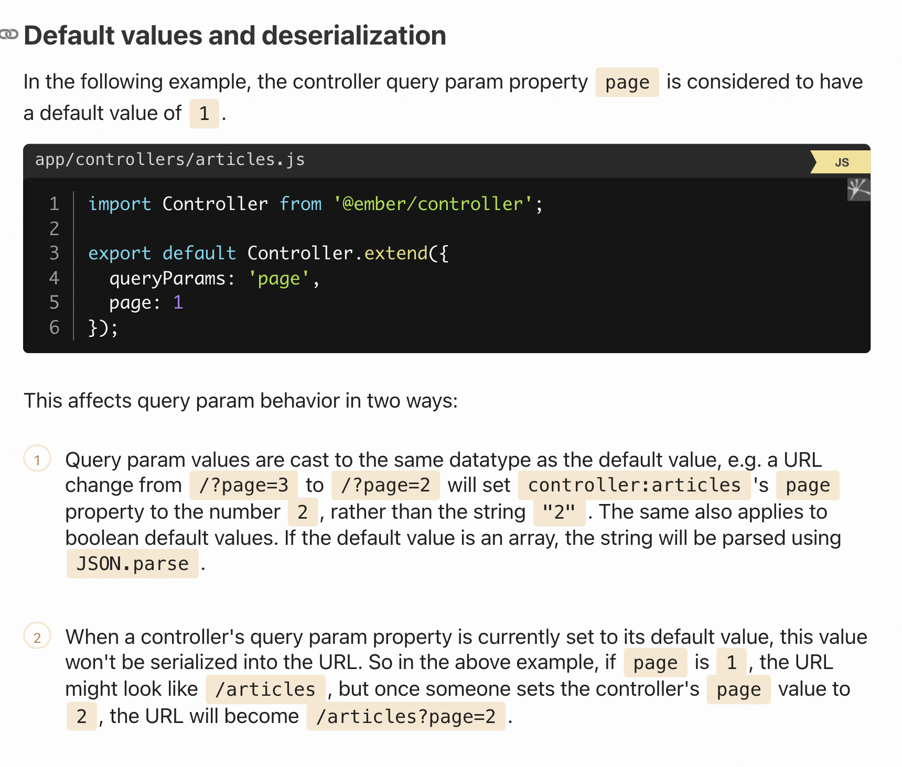

## Query Parameters

In web development, query parameters are used within a URL as described above but can also be used in API requests that retrieve data. Ember treats these as two different concepts. This section describes how routing query parameters are used in Ember. See finding records to see how query parameters are applied to API requests in Ember Data.

```js
//app/controllers/articles.js
import Controller from '@ember/controller';

export default Controller.extend({
  queryParams: ['category'],
  category: null
});
```

This sets up a binding between the category query param in the URL, and the category property on controller:articles. In other words, once the articles route has been entered, any changes to the category query param in the URL will update the category property on controller:articles, and vice versa.

 Note that you can't bind queryParams to computed properties, they have to be values. ?

 Now we need to define a computed property of our category-filtered array that the articles template will render:

```js
import Controller from '@ember/controller';
import { computed } from '@ember/object';

export default Controller.extend({
  queryParams: ['category'],
  category: null,

  filteredArticles: computed('category', 'model', function() {
    let category = this.category;
    let articles = this.model;

    if (category) {
      return articles.filterBy('category', category);
    } else {
      return articles;
    }
  })
});
```

### LinkTo component

The LinkTo component supports specifying query params using the query-params subexpression helper.

```hbs
// Explicitly set target query params
<LinkTo @route="posts" @query={{hash direction="asc"}}>Sort<LinkTo>

// Binding is also supported
<LinkTo @route="posts" @query={{hash direction=this.otherDirection}}>Sort<LinkTo>
```

- to finish later <https://guides.emberjs.com/v3.12.0/routing/query-params/#toc_transitionto>

### transitionTo

Route#transitionTo and Controller#transitionToRoute accept a final argument, which is an object with the key queryParams.

```js
this.transitionTo('post', object, { queryParams: { showDetails: true }});
this.transitionTo('posts', { queryParams: { sort: 'title' }});

// if you want to transition the query parameters without changing the route
this.transitionTo({ queryParams: { direction: 'asc' }});
```

You can also add query params to URL transitions:

```js
this.transitionTo('/posts/1?sort=date&showDetails=true');
```

### Opting into a full transition

When you change query params through a transition (transitionTo and `<LinkTo>`), it is not considered a full transition. This means that the controller properties associated with the query params will be updated, as will the URL, but no Route method hook like model or setupController will be called.

### Update URL with replaceState instead

By default, Ember will use pushState to update the URL in the address bar in response to a controller query param property change. If you would like to use replaceState instead, which prevents an additional item from being added to your browser's history, you can specify this as follows:

```js
import Route from '@ember/routing/route';

export default Route.extend({
  queryParams: {
    category: {
      replace: true
    }
  }
});
```

### Map a controller's property to a different query param key

you can map query params to a different key

```js
import Controller from '@ember/controller';

export default Controller.extend({
  queryParams: {
    category: 'articles_category'
  },

  category: null
});
```

mix remap, with standard mapping of query params

```js
import Controller from '@ember/controller';

export default Controller.extend({
  queryParams: ['page', 'filter', {
    category: 'articles_category'
  }],

  category: null,
  page: 1,
  filter: 'recent'
});
```

### Default values and deserialization



### Sticky Query Param Values

basicallty, ember by default remember query params for route, that way you can go back to it, either by history or navlink

`???`
In some cases, you might not want the sticky query param value to be scoped to the route's model but would rather reuse a query param's value even as a route's model changes. This can be accomplished by setting the scope option to "controller" within the controller's queryParams config hash:

```js
import Controller from '@ember/controller';

export default Controller.extend({
  queryParams: [{
    showMagnifyingGlass: {
      scope: 'controller'
    }
  }]
});
```