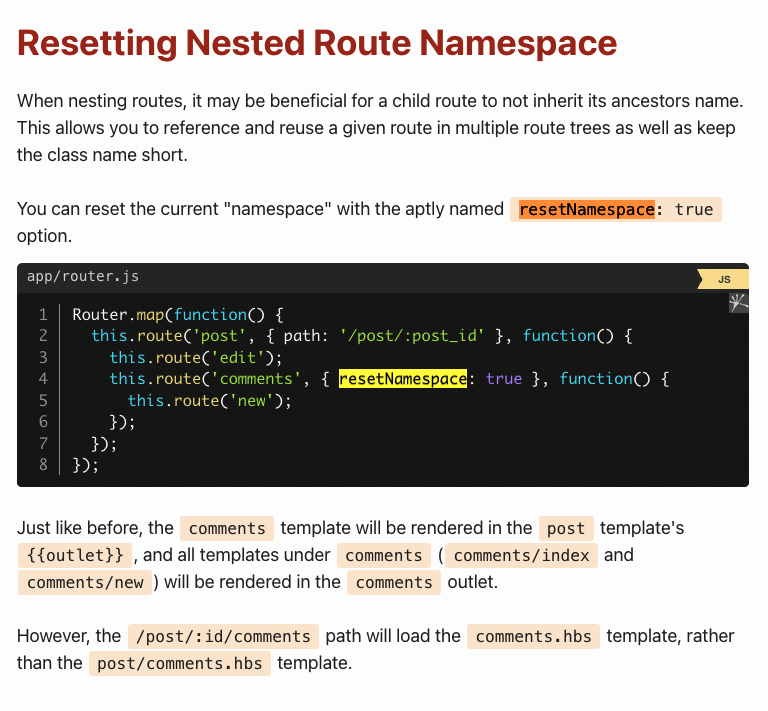

## Router

### map (Router.map)

``` js
Router.map(function(){
  this.route('post', { path: '/post/:post_id' }, function() {
    this.route('edit');
    this.route('comments', { resetNamespace: true }, function() {
      this.route('new');
    });
  });
});
```

The Router.map function allows you to define mappings from URLs to routes. These mappings are defined within the supplied callback function using this.route.

`this.route`

- first param: name of the route, default path(if no change supply)
- path: allow you to change the path
- resetNamespace 

## nested routes

`ember generate route posts/new`

in the template `{{outlet}}` will be the content of the nested route

## index route

- the is one catch 🎣, the index of / in render inside the oultlet of application

TODO: <https://guides.emberjs.com/v3.20.0/routing/defining-your-routes/#toc_when-to-use-an-index-route>

## dynamid segment

A dynamic segment is a portion of a URL that starts with a : and is followed by an identifier.

```js
Router.map(function() {
  this.route('posts');
  this.route('post', { path: '/post/:post_id' });
});
```

## Wildcard / globbing routes

 You can define wildcard routes that will match multiple URL segments. This could be used, for example, if you'd like a catch-all route which is useful when the user enters an incorrect URL not managed by your app.

```js
Router.map(function() {
  this.route('page-not-found', { path: '/*wildcard' });
});
```

## Resetting Nested Route Namespace

the third argument of this.route


meaning the template location will be reset that all

## Router

```js
Router.map(function() {
  this.route('photos', function(){
    this.route('edit', { path: '/:photo_id' });
  });
});
```

```hbs
<ul>
  {{#each this.photos as |p|}}
    <li>
      <LinkTo @route="photos.edit" @model={{p}}>{{p.title}}</LinkTo>
    </li>
  {{/each}}
</ul>
```

The @route argument is the name of the route to link to, and the @model argument is a model object to fill in the dynamic segment for the route.


<https://guides.emberjs.com/v3.20.0/routing/linking-between-routes/#toc_multiple-dynamic-segments>
 easy to understand

Ember is only able to infer the dynamic segments because the photo route is currently active. If we were to invoke the <LinkTo /> component for the same photos.photo.comment route, but from the photos route's template, it will result in an error, as we did not pass enough model objects to populate all the dynamic segments needed to generate the URL.

To solve this problem, or maybe to cross-link comments from photos other than the currently active one, you can pass an array of model objects using the @models argument and the {{array}} helper:

```hbs
<h1>Latest Comments</h1>

<ul>
  {{#each this.latestComments as |comment|}}
    <li>
      <LinkTo @route="photos.photo.comment" @models={{array comment.photo comment}}>
        {{excerpt comment.body}}...
      </LinkTo>
    </li>
  {{/each}}
</ul>
```

### Replacing history entries

The default behavior for the <LinkTo /> component is to add entries to the browser's history when transitioning between routes. However, to replace the current entry in the browser's history instead, you can use the @replace option:

```hbs
<LinkTo @route="photo.comment" @model={{this.topComment}} @replace={{true}}>
  Top comment for the current photo
</Link>
```

## routing and hooks

model is accessible in the template and controller

Behind the scenes, what is happening is that the route's controller receives the results of the model hook, and Ember makes the model hook results available to the template. Your app may not have a controller file for the route, but the behavior is the same regardless.

Note that Ember Data also has a feature called a Model, but it's a separate concept from a route's model hook.

<https://api.emberjs.com/ember-data/3.20/classes/Model>
<https://api.emberjs.com/ember/3.20/classes/Route/methods/model?anchor=model>

### Multiple Models

What should you do if you need the model to return the results of multiple API requests?

Multiple models can be returned through an RSVP.hash. The RSVP.hash method takes an object containing multiple promises. If all of the promises resolve, the returned promise will resolve to an object that contains the results of each request.

```js
import Route from '@ember/routing/route';
import { inject as service } from '@ember/service';
import RSVP from 'rsvp';

export default class SongsRoute extends Route {
  @service store;

  model() {
    return RSVP.hash({
      songs: this.store.findAll('song'),
      albums: this.store.findAll('album')
    });
  }
}
```

### Dynamic Models

fetching data for dynamicsm, ie: /photo/32

in Ember, this can be accomplished by defining routes with dynamic segments, or by using query parameters, and then using the dynamic data to make requests.

```js
Router.map(function() {
  this.route('posts');
  this.route('post', { path: '/post/:post_id' });
});
```

```js
import Route from '@ember/routing/route';

export default class PostRoute extends Route {
  model(params) {
    console.log('This is the dynamic segment data: ' + params.post_id);
    // make an API request that uses the id
  }
}

```

If you do not define a model hook for a route, it will default to using Ember Data to look up the record, as shown below:

ember does a default behaviour if not meant explicitly,

If you do not define a model hook for a route, it will default to using Ember Data to look up the record, as shown below:

```js
model(params) {
 return this.store.findRecord('post', params.post_id);
}
```

## Linking to a dynamic segment

When you provide a string or number to the <LinkTo>, the dynamic segment's model hook will run when the app transitions to the new route. In this example, photo.id might have an id of 4:

```hbs
{{#each @model as |photo|}}
  <LinkTo @route="photo" @model={{photo.id}}>
    link text to display
  </LinkTo>
{{/each}}
```

Here's what it looks like to pass the entire photo record:

```hbs
{{#each @model as |photo|}}
  <LinkTo @route="photo" @model={{photo}}>
    link text to display
  </LinkTo>
{{/each}}
```

### not important

If a route you are trying to link to has multiple dynamic segments, like /photos/4/comments/18, be sure to specify all the necessary information for each segment:

```hbs
<LinkTo @route="photos.photo.comments.comment" @models={{array 4 18}}>
  link text to display
</LinkTo>
```

## Reusing Route Context - Important

Sometimes you need to fetch a model, but your route doesn't have the parameters, because it's a child route and the route directly above or a few levels above has the parameters that your route needs.

In this scenario, you can use the paramsFor method to get the parameters of a parent route.

```js
//app/routes/album/index.js

import Route from '@ember/routing/route';
import { inject as service } from '@ember/service';

export default class AlbumIndexRoute extends Route {
  @service store;

  model() {
    let { album_id } = this.paramsFor('album');

    return this.store.query('song', { album: album_id });
  }
}
```

Using paramsFor will also give you the query params defined on that route's controller. This method could also be used to look up the current route's parameters from an action or another method on the route, and in that case we have a shortcut: this.paramsFor(this.routeName).

In our case, the parent route had already loaded its songs, so we would be writing unnecessary fetching logic. Let's rewrite the same route, but use modelFor, which works the same way, but returns the model from the parent route.

```js
//app/routes/album/index.js
import Route from '@ember/routing/route';

export default class AlbumIndexRoute extends Route {
  model() {
    let { songs } = this.modelFor('album');

    return songs;
  }
}
```

In the case above, the parent route looked something like this:

```js
import Route from '@ember/routing/route';
import { inject as service } from '@ember/service';
import RSVP from 'rsvp';

export default class AlbumRoute extends Route {
  @service store;

  model({ album_id }) {
    return RSVP.hash({
      album: this.store.findRecord('album', album_id),
      songs: this.store.query('song', { album: album_id })
    });
  }
}
```

## Debugging models

If you are having trouble getting a model's data to show up in the template, here are some tips:

- Use the [`{{debugger}}`](https://api.emberjs.com/ember/3.20/classes/Ember.Templates.helpers/methods/debugger?anchor=debugger) or [`{{log}}`](https://api.emberjs.com/ember/3.20/classes/Ember.Templates.helpers/methods/log?anchor=log) helper to inspect the `{{@model}}` from the template
- return hard-coded sample data as a test to see if the problem is really in the model hook, or elsewhere down the line
- study JavaScript Promises in general, to make sure you are returning data from the Promise correctly
- make sure your `model` hook has a `return` statement
- check to see whether the data returned from a `model` hook is an object, array, or JavaScript Primitive. For example, if the result of `model` is an array, using `{{@model}}` in the te
mplate won't work. You will need to iterate over the array with an [`{{#each}}`](https://api.emberjs.com/ember/3.20/classes/Ember.Templates.helpers/methods/each?anchor=each) helper. If the result is an object, you need to access the individual attribute like `{{@model.title}}` to render it in the template.
- use your browser's development tools to examine the outgoing and incoming API responses and see if they match what your code expects
- If you are using Ember Data, use the [Ember Inspector](https://guides.emberjs.com/v3.20.0/routing/specifying-a-routes-model//../../ember-inspector/) browser plugin to explore the View Tree/Model and Data sections.

[](https://guides.emberjs.com/v3.20.0/routing/linking-between-routes/)
