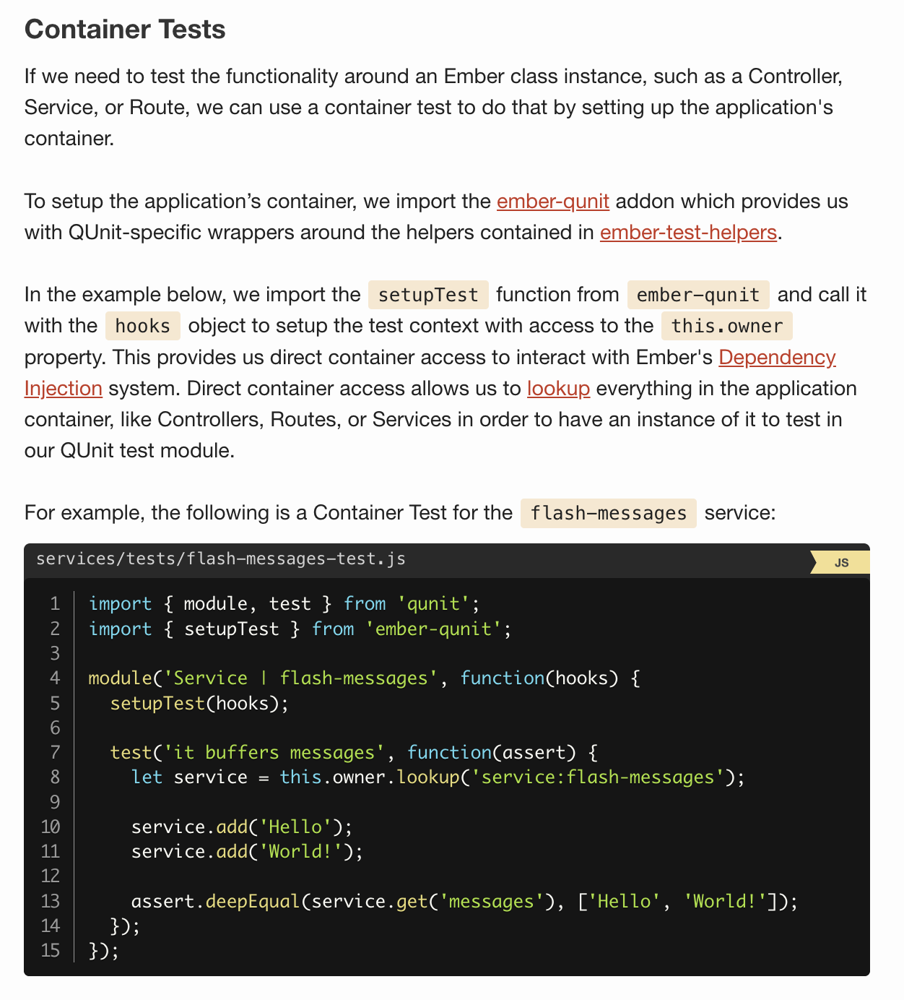

# Intro

[QUnit](http://qunitjs.com/) is the default testing framework for this guide, but others are supported too, through addons such as [ember-mocha](https://github.com/emberjs/ember-mocha).

- unit test
- container test
- rendering test
- application test

## Unit Tests

To get started writing tests, we start with a plain unit test. In the example below, we are testing the function relativeDate() by passing a mock value into the function and asserting if the output is what we expected.

```js
//utils/tests/relative-date-test.js

import { module, test } from 'qunit';
import { relativeDate } from 'my-app-name/utils/date-utils';

module('relativeDate', function(hooks) {
  test('format relative dates correctly', function(assert) {
    assert.equal(relativeDate('2018/01/28 22:24:30'), 'just now');
    assert.equal(relativeDate('2018/01/28 22:23:30'), '1 minute ago');
    assert.equal(relativeDate('2018/01/28 21:23:30'), '1 hour ago');
    assert.equal(relativeDate('2018/01/27 22:23:30'), 'Yesterday');
    assert.equal(relativeDate('2018/01/26 22:23:30'), '2 days ago');
  });
});
```

Notice how there is nothing Ember specific about the test, it is just a straightforward assertion with only QUnit test code in isolation. There is no need to add any Ember specific logic since it does not require the application's container to be setup nor any user interaction.



## Rendering Tests

Rendering Tests are, as the name suggests, rendering components and helpers by verifying the correct behavior when the component or helper interacts with the system in the same way that it will within the context of the application, including being rendered from a template and receiving Ember's lifecycle hooks.

In terms of setting up the test – Rendering Tests are roughly similar to Container Tests but instead of using setupTest from ember-qunit, we import and invoke setupRenderingTest to render templates, including components and helpers (setupRenderingTest is actually using setupTest underneath so everything we had from Container Tests are still applicable.)

For the example below, we also import the render and click functions from ember-test-helpers to show and interact with the component being tested as well as hbs from htmlbars-inline-precompile to help with inline template definitions. With these APIs, we can test clicking on this component and check if the text is successfully updated with each click

```js
import { module, test } from 'qunit';
import { setupRenderingTest } from 'ember-qunit';
import { render, click } from '@ember/test-helpers';
import hbs from 'htmlbars-inline-precompile';

module('Component | counter', function(hooks) {
  setupRenderingTest(hooks);

  test('it should count clicks', async function(assert) {
    this.set('value', 0);

    await render(hbs`<Counter @value={{this.value}} @onUpdate={{( … )}} />`);
    assert.equal(this.element.textContent, '0 clicks');

    await click('.counter');
    assert.equal(this.element.textContent, '1 click');
  });
});
```

Rendering Tests are used to test Components and Helpers where we need to render a layout and assert some interaction byproduct occurs.

## Application Tests

Finally if we are looking to test user interaction and application flow in order to verify user stories or a feature from an end-user perspective, we can use Application Tests. In these kinds of tests, we interact with the application in the same ways that a user would, such as filling out form fields and clicking buttons. Application tests ensure that the interactions within a project are basically functional, the core features of a project have not regressed, and the project's goals are being met.

Similar to how Rendering Tests builds on top of Container Tests, to setup Application Tests, we import a setup method called setupApplicationTest from ember-qunit (this also uses setupTest underneath.) Unlike Rendering Tests, however, we import the visit helper from ember-test-helpers instead of the render helper. The visit helper is used to visit a route in the application where we need to assert some end-user behavior.

```js
import { module, test } from 'qunit';
import { setupApplicationTest } from 'ember-qunit';
import { visit, fillIn, click } from '@ember/test-helpers';

module('Acceptance | posts', function(hooks) {
  setupApplicationTest(hooks);

  test('should add new post', async function(assert) {
    await visit('/posts/new');
    await fillIn('input.title', 'My new post');
    await click('button.submit');

    const title = this.element.querySelector('ul.posts li:first').textContent;
    assert.equal(title, 'My new post');
  });
});
```

Examples of Application Tests are:

- A user being able to log in via the login form
- A user is able to create a blog post.
- After saving a new post successfully, a user is then shown the list of prior posts.
- A visitor does not have access to the admin panel.

### Testing Blueprints[](https://guides.emberjs.com/v3.12.0/testing/#toc_testing-blueprints)
