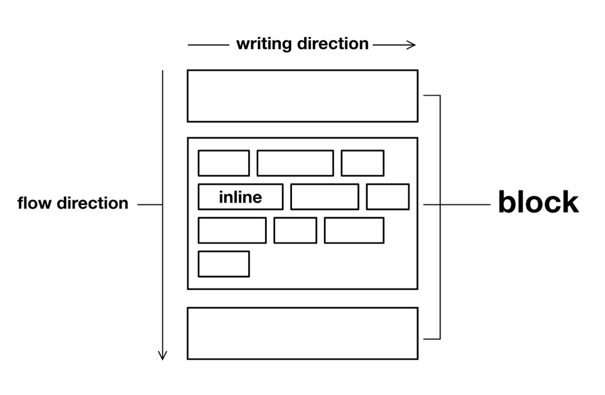
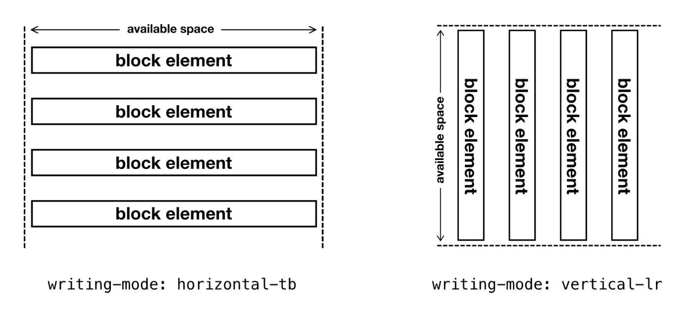

# My french note of every layout

## Axioms

### globals

pour appliquer des regles globales en css, on doit d'abord s'interessé aux selecteurs. Parmi les multiples manieres de faire, on pourrait etre tenté d'utiliser des utility class

```css
measure-cap{
    max-inline-size:60ch;
}
```

***Note***:On part du principe(ie:prend comme example) design que les lignes ne doivent pas depasser 60 characteres. `cela facilite la lecture`. De plus nous utilisons inline-size qui comme width mais depend du sens de lecture (voir plus tard, logical units)

mais cela nous fait l'appliquer manuellement partout.
Une autre approche serait de cibler les elements css (`h1,..,h6,p,...`). Il faut quand meme identifier les elements qui ne rentre pas dans ces regles, la plupart du temps ce sont les block element(`div,body,..`) ou les flow elements comme `em, small,..`

Cela nous donne donc

```css
p,h1,h2,h3,h4,h5,h6,li,figcaption{
    max-inline-size:60ch
}
```

##### L'exception based styling

On peut aussi tout selectionné sauf les cas ou cela ne s'applique pas

```css
*{
    max-inline-size:60ch;
}
html,body,div,header,nav,main,footer,small,figcaption,..{
    max-inline-size:none;
}
```

##### A universal value

[...] +- = utiliser des var dans root

##### escaping 

note that we can escape in css,m this allow us to do this

```css
max-inline-size\:measure{
    max-inline-size: var(--measure)
}
max-inline-size\:measure\/2{
    max-inline-size: calc(var(--measure)/2)
}
```
and use it like this

```html
 <div class="max-inline-size:measure">..</div>
 <div class="max-inline-size:measure/2">..</div>
```

## Boxes

> "everything in the web design is a box or the absence of a box" rachel andrew

certaines proprietes comme `border-radius`, `clip-path` et `transform` change l'allure des boites mais on reste toujours avec des boites, box-like (ou meme comme des hits-box comme on l'appelle dans les jeux-video)

#### The box model

`margin > border > padding > content`

#### The display property

Au debut du css, on n'avait que `display:block` et `display:inline`. La grande difference entre block et inline tiens a la "direction" que l'element prends. block suit la direction block la ou inline va dans la direction d'ecriture. (Il est important de ne pas dire haut-bas et droite-gauche car d'autres langues vont dans d'autres sens).



