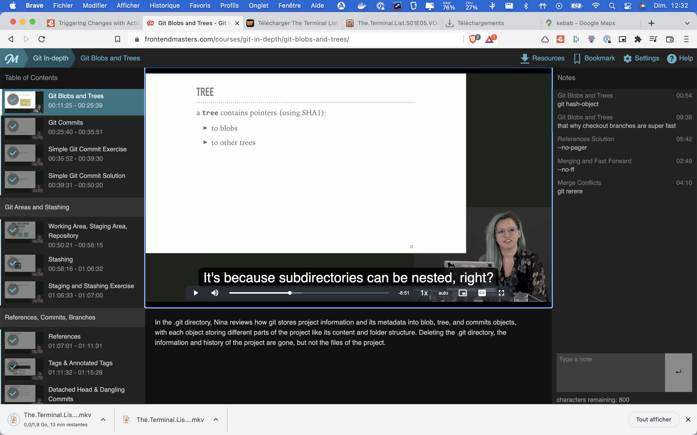
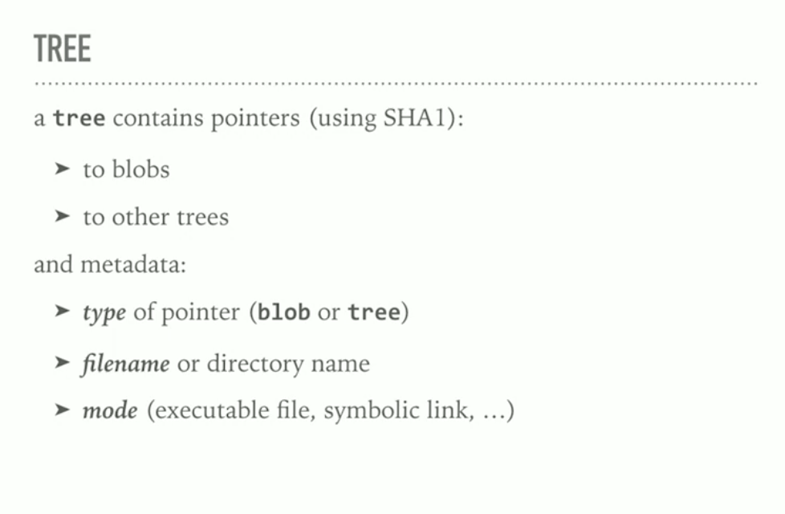

# -

git store the compress data with a header

like this:

- the identifier blob (blob is one of the enum of the type that git hanlde)
- the size of the content
- the \0 delimiter
- the content

asking git for the sha1 of a content:

- `echo "hello-world" | git hash-object --stdin`
<!-- = 6b820fd9037ce516d22549dde403f3bb9a41ad8e -->

asking git for the sha1 of the content with metadata:

- `echo 'blob 14\0Hello, World!' | openssl sha1`
<!-- 5ad1cb82b3edb9d3ef1ae227745c90bcd23d2120 -->

git store information about the blob in a tree, filename and directory structure

it contains:

- pointers to blob
- pointers to others directory / tree
- metadata
  - type of pointer (blob or tree)
  - filename or directory name of the thing, it is pointer to
  - mode (is a file executable is it a symlink ?)

storing mode, is useful for example, if somebody clone yoour repo, the file will be executable in their computer too

this is critical comparing to other version control system  like svn, since it save a lot a place. That also why checkout is super-fast, only the thing that change have a pointer changing, most tree stay the same

it can also be explanable, by how our files change. Small modification, git will compress the files together into packfiles.

The packfiles stores the objects and the `deltas`, ie the differences between one version of the file text and the next

Packfiles are generated if you have to many objects, during garbage collection, during a push to remote

--
Git run garbage collection, every few weeks or when you ask for it
--

Now you can understand what happens when during a push, there is the message `compressing deltas`

a commit, the sha1 of the commit is the sha of all of this

- point to a tree
- metadata
  - author and commiter
  - date
  - message
  - parent commit(one or more) if there are

a commit is a code snapshot

if you want to look a the content of `git objects` using `cat` won't work because they are compressed, using `git cat-file -t <hash>` will.

`git cat-file -t 980a0`
<!-- blob (-t print the type) -->

`git cat-file -p 980a0`
<!-- Hello World! (-p print the content) -->

References

references are pointers to commit

- tags
- branches
- HEAD - pointer to the current commit
