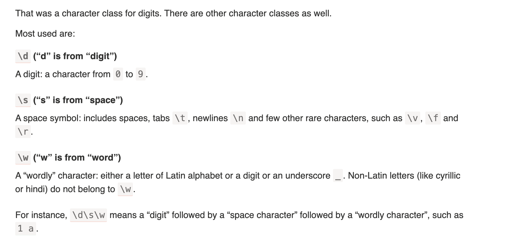
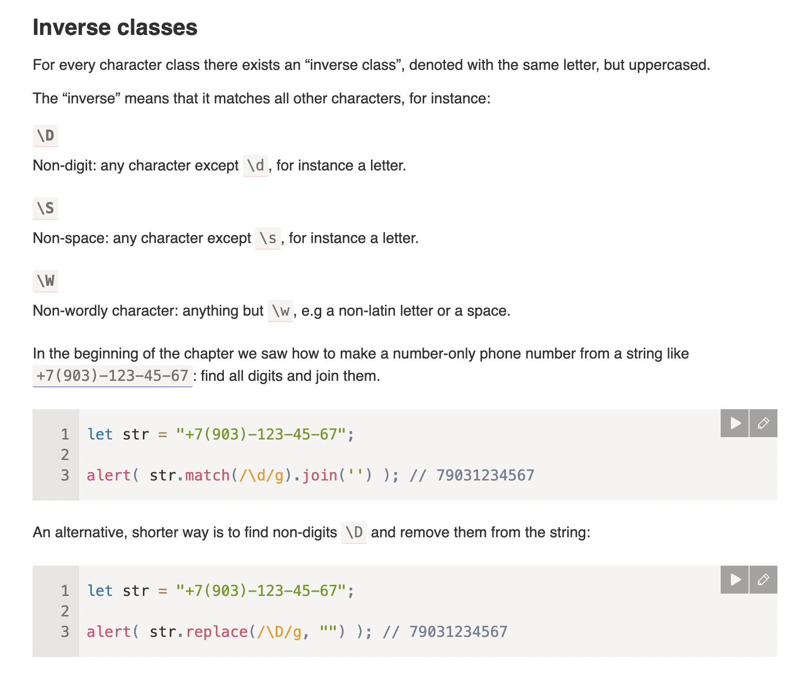
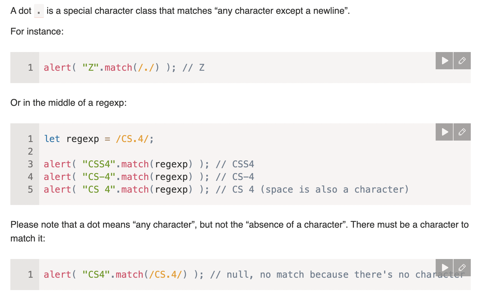

# Character classes

## [Summary](https://javascript.info/regexp-character-classes#summary)

​
There exist following character classes:
​

- `\d` – digits.
- `\D` – non-digits.
- `\s` – space symbols, tabs, newlines.
- `\S` – all but `\s`.
- `\w` – Latin letters, digits, underscore `'_'`.
- `\W` – all but `\w`.
- `.` – any character if with the regexp `'s'` flag, otherwise any except a newline `\n`.
​
…But that’s not all!
​
Unicode encoding, used by JavaScript for strings, provides many properties for characters, like: which language the letter belongs to (if it’s a letter), is it a punctuation sign, etc.
​
We can search by these properties as well. That requires flag `u`, covered in the next article.
​


A character class is a special notation that matches any symbol from a certain set.



## Inverse classes



## A dot is “any character”



## Dot as literally any character with “s” flag

s flag enable dotall

```js
alert( "A\nB".match(/A.B/s) ); // A\nB (match!)
```

## [Summary](https://javascript.info/regexp-character-classes#summary)

​
There exist following character classes:
​

- `\d` – digits.
- `\D` – non-digits.
- `\s` – space symbols, tabs, newlines.
- `\S` – all but `\s`.
- `\w` – Latin letters, digits, underscore `'_'`.
- `\W` – all but `\w`.
- `.` – any character if with the regexp `'s'` flag, otherwise any except a newline `\n`.
​
…But that’s not all!
​
Unicode encoding, used by JavaScript for strings, provides many properties for characters, like: which language the letter belongs to (if it’s a letter), is it a punctuation sign, etc.
​
We can search by these properties as well. That requires flag `u`, covered in the next article.
​

