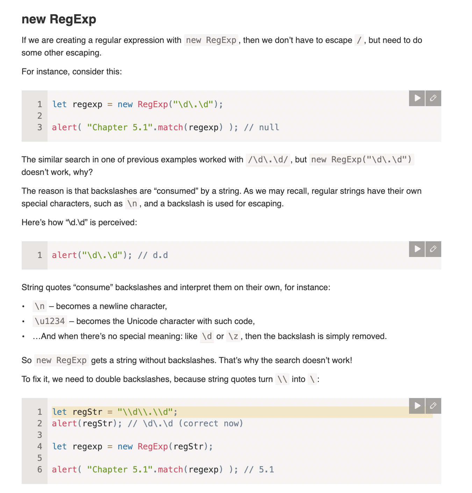

# Escaping, special characters

## [Summary](https://javascript.info/regexp-escaping#summary)

- To search for special characters `[ \ ^ $ . | ? * + ( )` literally, we need to prepend them with a backslash `\` (“escape them”).
- We also need to escape `/` if we’re inside `/.../` (but not inside `new RegExp`).
- When passing a string to `new RegExp`, we need to double backslashes `\\`, cause string quotes consume one of them.

## -

As we’ve seen, a backslash \ is used to denote character classes, e.g. \d. So it’s a special character in regexps (just like in regular strings).

There are other special characters as well, that have special meaning in a regexp, such as [ ] { } ( ) \ ^ $ . | ? * +. They are used to do more powerful searches.

## Escaping

`\.` for example

## new regex

## [Summary](https://javascript.info/regexp-escaping#summary)

- To search for special characters `[ \ ^ $ . | ? * + ( )` literally, we need to prepend them with a backslash `\` (“escape them”).
- We also need to escape `/` if we’re inside `/.../` (but not inside `new RegExp`).
- When passing a string to `new RegExp`, we need to double backslashes `\\`, cause string quotes consume one of them.
