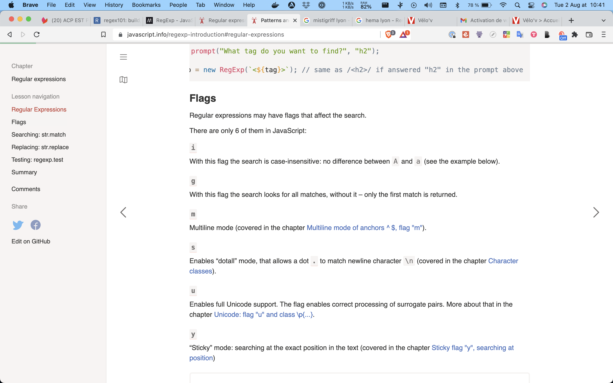
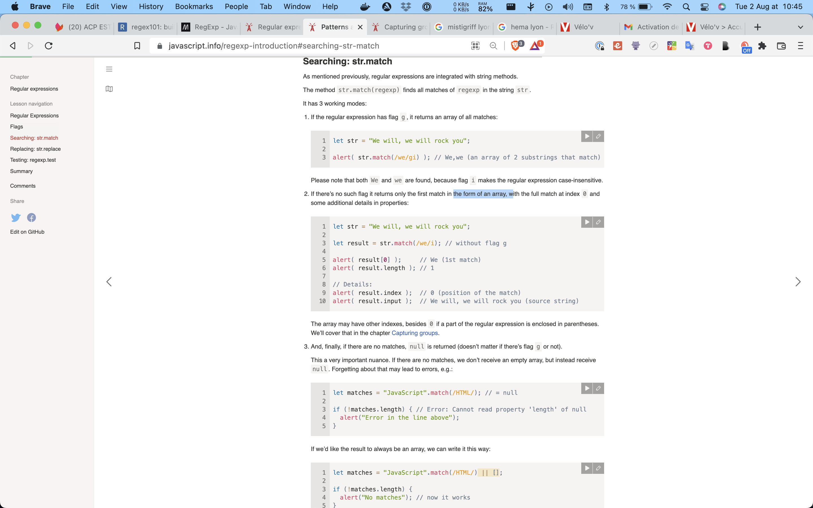
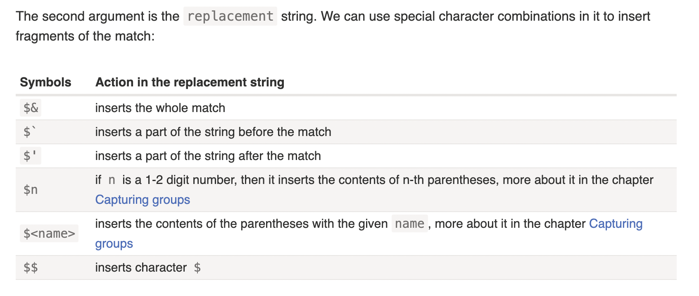

# Intro

## Summary

- A regular expression consists of a pattern and optional flags: `g`, `i`, `m`, `u`, `s`, `y`.
- Without flags and special symbols (that we’ll study later), the search by a regexp is the same as a substring search.
- The method `str.match(regexp)` looks for matches: all of them if there’s `g` flag, otherwise, only the first one.
- The method `str.replace(regexp, replacement)` replaces matches found using `regexp` with `replacement`: all of them if there’s `g` flag, otherwise only the first one.
- The method `regexp.test(str)` returns `true` if there’s at least one match, otherwise, it returns `false`.

## Patterns and flags

## regular-expressions

there is two way of defining a regex

The “long” syntax:

```js
regexp = new RegExp("pattern", "flags");
```

And the “short” one, using slashes "/":

```js
regexp = /pattern/; // no flags
regexp = /pattern/gmi; // with flags g,m and i (to be covered soon)
```

Slashes /.../ tell JavaScript that we are creating a regular expression. They play the same role as quotes for strings.

In both cases regexp becomes an instance of the built-in RegExp class.

The main difference between these two syntaxes is that pattern using slashes /.../ does not allow for expressions to be inserted (like string template literals with ${...}). They are fully static.

Slashes are used when we know the regular expression at the code writing time – and that’s the most common situation. While new RegExp is more often used when we need to create a regexp “on the fly” from a dynamically generated string. For instance:

```js
let tag = prompt("What tag do you want to find?", "h2");

let regexp = new RegExp(`<${tag}>`); // same as /<h2>/ if answered "h2" in the prompt above
```

## flag



## Searching: `str.match`

As mentioned previously, regular expressions are integrated with string methods.

The method str.match(regexp) finds all matches of regexp in the string str.



## Replacing: `str.replace`

```js
// no flag g
alert( "We will, we will".replace(/we/i, "I") ); // I will, we will

// with flag g
alert( "We will, we will".replace(/we/ig, "I") ); // I will, I will
```



An example with $&:

```js
alert( "I love HTML".replace(/HTML/, "$& and JavaScript") ); // I love HTML and JavaScript
```

## Testing: `regexp.test`

## Summary

- A regular expression consists of a pattern and optional flags: `g`, `i`, `m`, `u`, `s`, `y`.
- Without flags and special symbols (that we’ll study later), the search by a regexp is the same as a substring search.
- The method `str.match(regexp)` looks for matches: all of them if there’s `g` flag, otherwise, only the first one.
- The method `str.replace(regexp, replacement)` replaces matches found using `regexp` with `replacement`: all of them if there’s `g` flag, otherwise only the first one.
- The method `regexp.test(str)` returns `true` if there’s at least one match, otherwise, it returns `false`.
