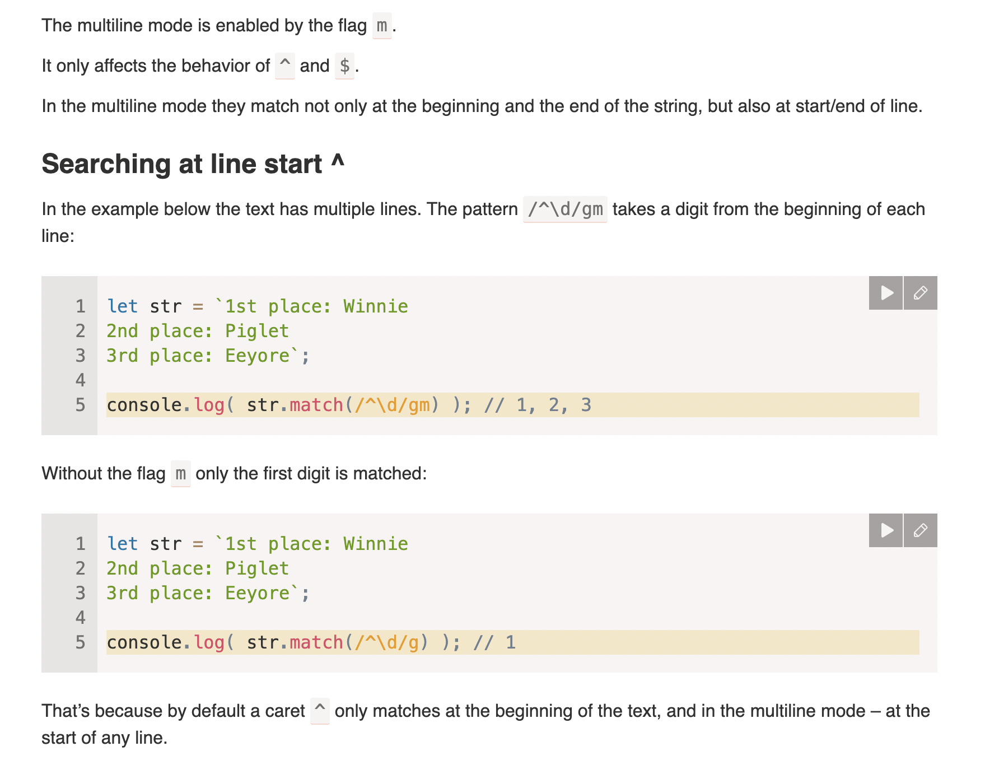

# Multi-mode



## Searching for \n instead of ^ $

we could have also search with

```js
let str = `Winnie: 1
Piglet: 2
Eeyore: 3`;

console.log( str.match(/\d\n/g) ); // 1\n,2\n
```

but we have only 2 matchs and \n

