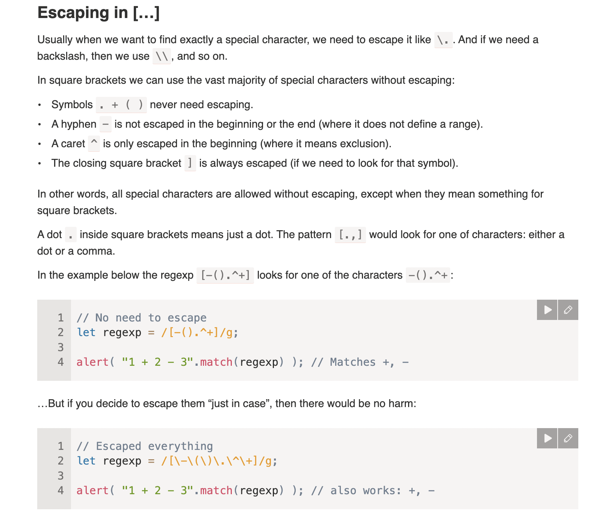

# Sets and ranges [...]

Several characters or character classes inside square brackets […] mean to “search for any character among given”.

## Sets

For instance, [eao] means any of the 3 characters: 'a', 'e', or 'o'.

That’s called a set. Sets can be used in a regexp along with regular characters:

```js
// find [t or m], and then "op"
alert( "Mop top".match(/[tm]op/gi) ); // "Mop", "top"
```

## Ranges

For instance, [a-z] is a character in range from a to z, and [0-5] is a digit from 0 to 5.

```js
alert( "Exception 0xAF".match(/x[0-9A-F][0-9A-F]/g) ); // xAF
```

Here [0-9A-F] has two ranges: it searches for a character that is either a digit from 0 to 9 or a letter from A to F.

If we’d like to look for lowercase letters as well, we can add the range a-f: [0-9A-Fa-f]. Or add the flag i.

We can also use character classes inside […].

For instance, if we’d like to look for a wordly character \w or a hyphen -, then the set is [\w-].

Combining multiple classes is also possible, e.g. [\s\d] means “a space character or a digit”.

## Excluding ranges

Besides normal ranges, there are “excluding” ranges that look like [^…].

They are denoted by a caret character ^ at the start and match any character except the given ones.

For instance:

[^aeyo] – any character except 'a', 'e', 'y' or 'o'.
[^0-9] – any character except a digit, the same as \D.
[^\s] – any non-space character, same as \S.


## Escaping in […]



## Ranges and flag “u”