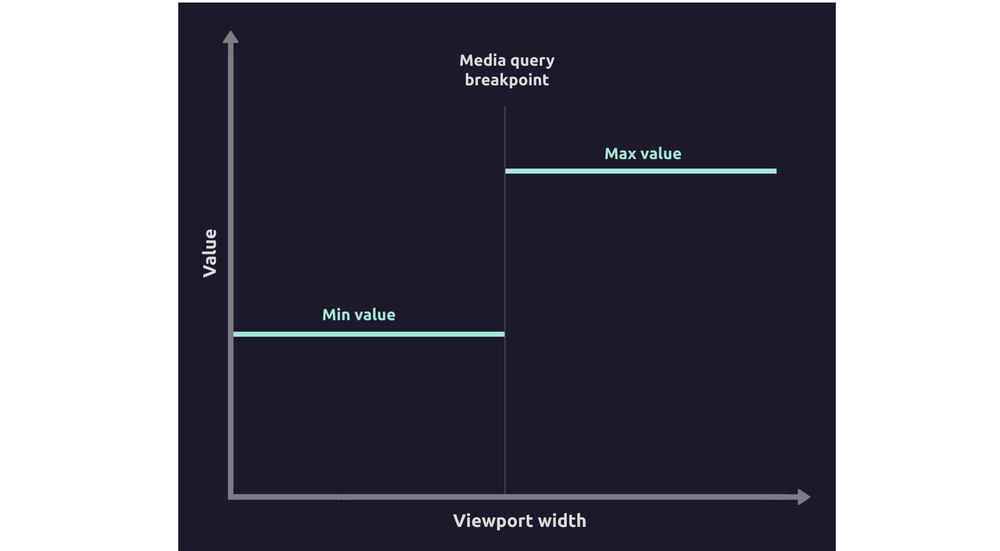
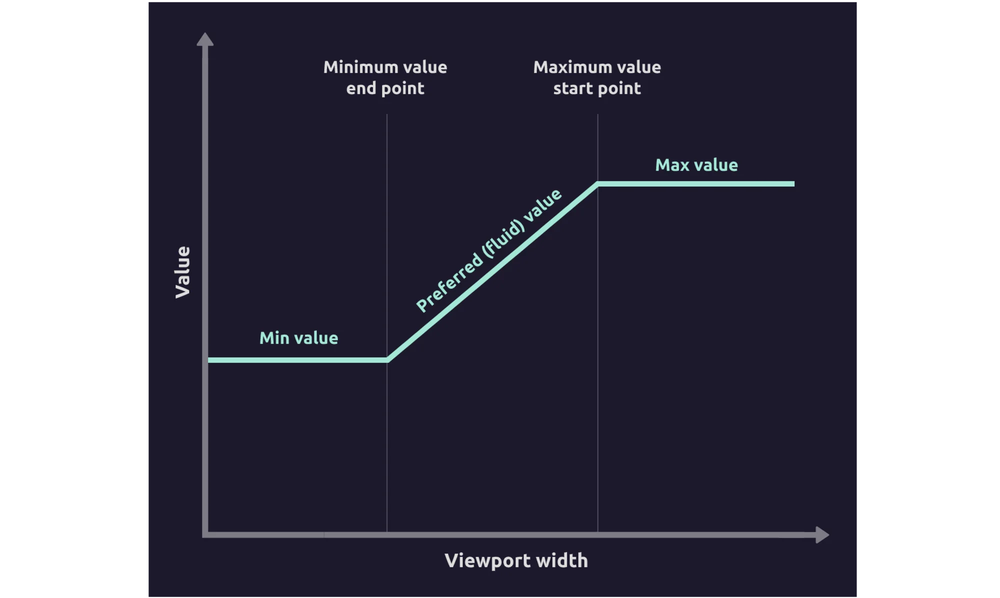
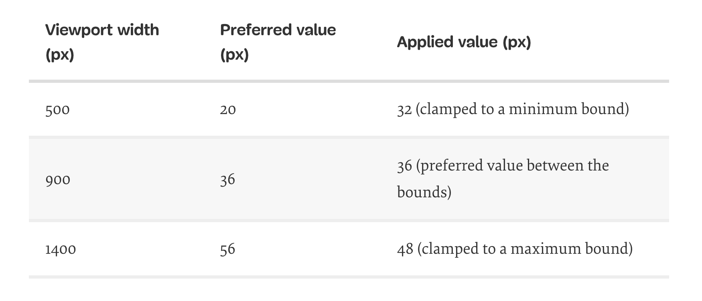
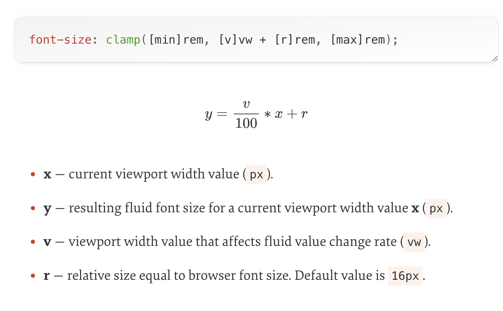
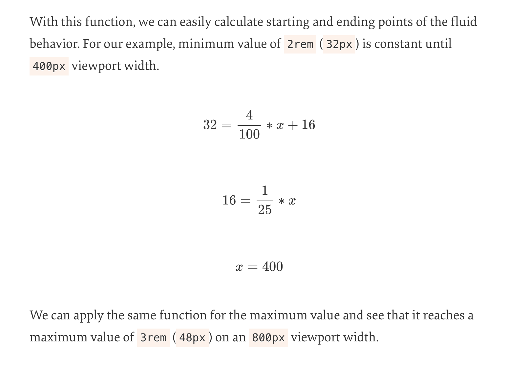
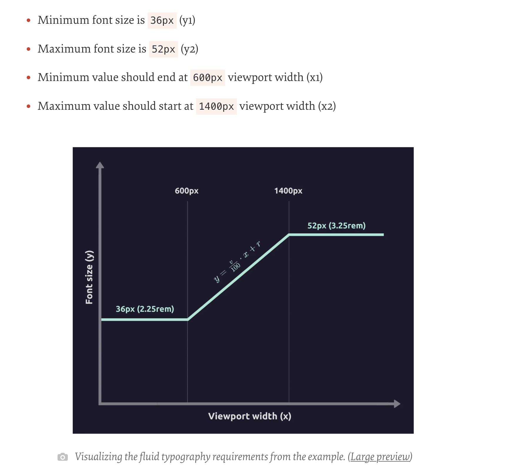

# Modern-Fluid-Typography-Using-Css-Clamp

[link](https://www.smashingmagazine.com/2022/01/modern-fluid-typography-css-clamp/)

Usually, when we implement responsive typography, values change on specific breakpoints. They are explicitly defined. So designers often provide typographic values (font sizes, line heights, letter spacings, etc.) `for two, three, or even more screen sizes`, and developers usually implement these requirements by adding media queries to target specific breakpoints.



Fluid typography scales smoothly between the minimum and maximum value depending on the viewport width. It usually starts with a minimum value and it maintains the constant value until a specific screen width point at which it starts increasing. Once it reaches a maximum value at another screen width, it maintains that maximum value from there on.



This approach reduces or eliminates the fine-tuning for specific breakpoints and other edge cases. Although it’s mostly used in typography, this fluid sizing approach also works for margin, padding, gap, etc.


## First Attempts At Fluid Typography

The first real CSS implementation of fluid typography came with the introduction of CSS calc and viewport units (vw and vh).

```css
/* Fixed minimum value below the minimum breakpoint */
.fluid {
  font-size: 32px;
}

/* Fluid value from 568px to 768px viewport width */
@media screen and (min-width: 568px) {
  .fluid {
    font-size: calc(32px + 16 * ((100vw - 568px) / (768 - 568));
  }
}

/* Fixed maximum value above the maximum breakpoint */
@media screen and (min-width: 768px) {
  .fluid {
    font-size: 48px;
  }
}
```

Let’s focus on selectors and media queries to see the cases they cover.

```css
.fluid { /* Min value */ }

@media screen and (min-width: [breakpoint-min]) {
.fluid { /* Preferred value between the minimum and maximum bound */ }

@media screen and (min-width: [breakpoint-max]) { /* Max value */ }
```

In the mobile-first approach, the first selector fixes the value to a minimum bound. The final breakpoint fixes the value to a maximum bound. And The first media query handles fluid behavior between the two breakpoints. 

```css
.fluid {
 font-size: [value-min];
}

@media (min-width: [breakpoint-min]) {
  .fluid {
    font-size: calc([value-min] + ([value-max] - [value-min]) * ((100vw - [breakpoint-min]) / ([breakpoint-max] - [breakpoint-min])));
  }
}

@media (min-width: [breakpoint-max]) {
  .fluid {
    font-size: [value-max]
  }
}
```

## CSS clamp Function

CSS clamp function takes three values — a minimum bound, preferred value, and a maximum bound

Preferred value usually includes viewport units, percentages, or other relative units to achieve the fluid effect. This is so robust and flexible function that alongside the fixed values, it can accept even math functions and expressions, and values from the attr function.

This function can be applied to any attribute which accepts a valid value type like length, frequency, time, angle, percentage, number, and others, so it can be used beyond typography and sizing.

## Fluid Typography With CSS clamp

Let’s take a look at the following example and set the font size to have a value between 32px and 48px.

```css
font-size: clamp(32px, 4vw, 48px);
```

`4 vw =  4% of current viewport width`

Let’s take a quick look at which value will be applied for this example depending on the viewport width, so we can get a good grasp of how the CSS clamp function works.



We can notice two issues with this clamp function value:

- Minimum and maximum bounds are expressed with pixel values, so they won’t scale if a user changes their preferred font size.

- Viewport value for preferred value is not accessible. This value depends on the viewport width exclusively and it doesn’t take user preferences into account.

- The preferred value is unclear. We are using 4vw which might look like a magic number at first. We need to know when the fluid behavior starts and ends. 

We can easily address the first issue by converting px values to rem values for minimum and maximum bounds by dividing the px values by 16 (default browser font size). By doing that, minimum and maximum values will adapt to user browser preferences.`font-size: clamp(2rem, 4vw, 3rem);`

We need to take a different approach with the preferred value, as this value needs to respond to the viewport size and user preference

```css
font-size: clamp(2rem, 4vw + 1rem, 3rem);
```

Please note that this is not a foolproof solution for all accessibility issues, so it’s still important to test if the fluid typography can be zoomed in enough and if it responds well enough to user accessibility preferences. 

However, we still do not know how we got the preferred value from the example (4vw + 1rem) to achieve the required fluid behavior, so let’s take a look at how we can fine-tune the preferred value and fully understand the math behind it.

## Fluid Sizing Function 

a function that is used to calculate it.





The purpose of this example was just to demonstrate how the preferred value affects the fluid typography behavior. Let’s use the same function for a slightly more realistic scenario and solve a more practical real-world example. We’ll create accessible fluid typography based on required font sizes and specific points where we want the fluid behavior to occur.

## CALCULATING PREFERRED VALUE PARAMETERS BASED ON SPECIFIC STARTING AND ENDING POINTS


