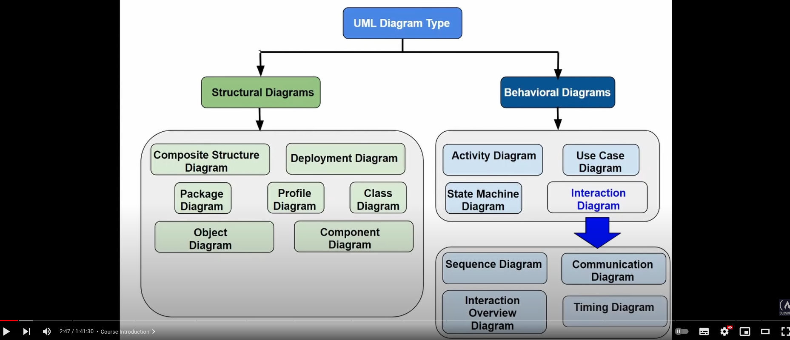
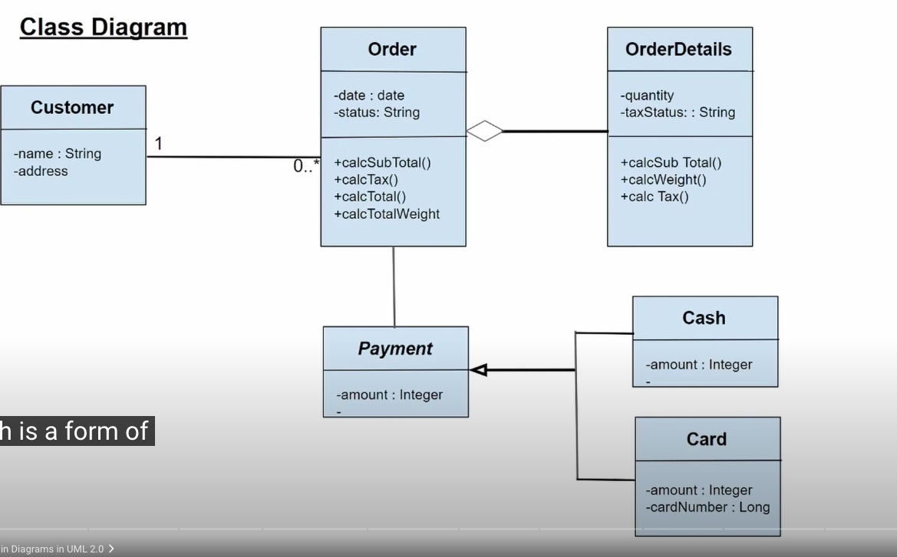
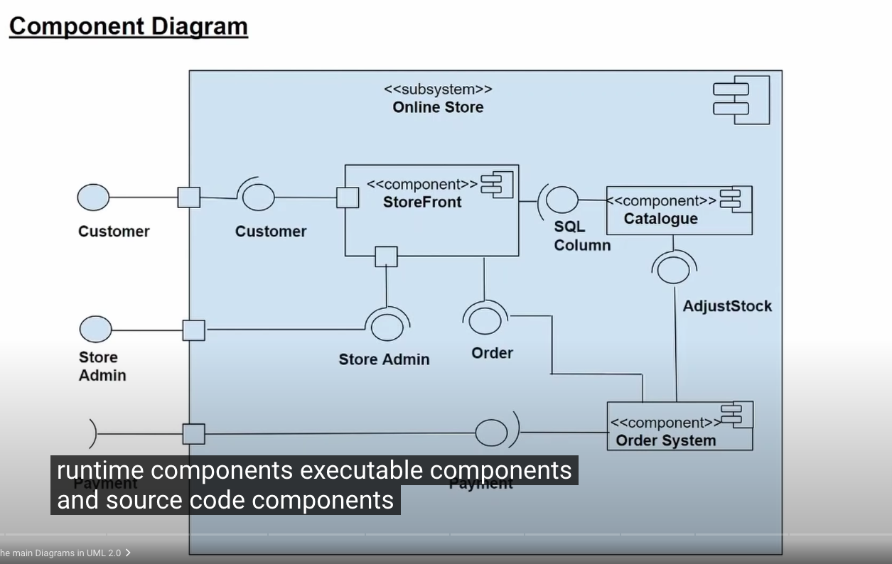
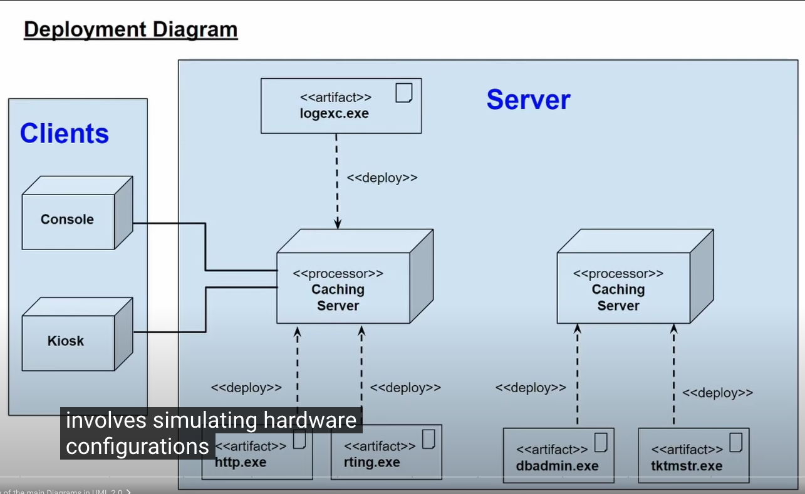
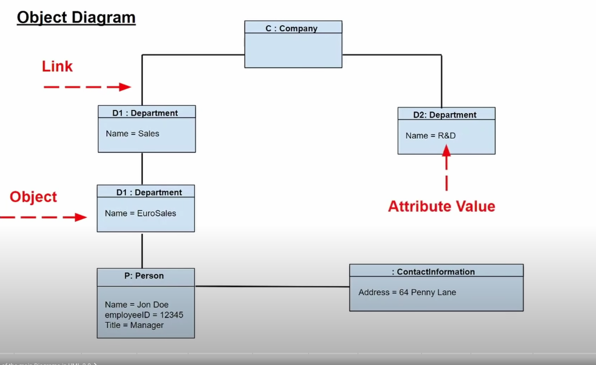
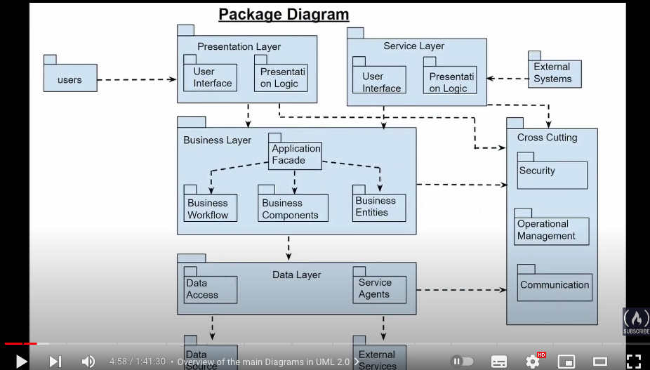
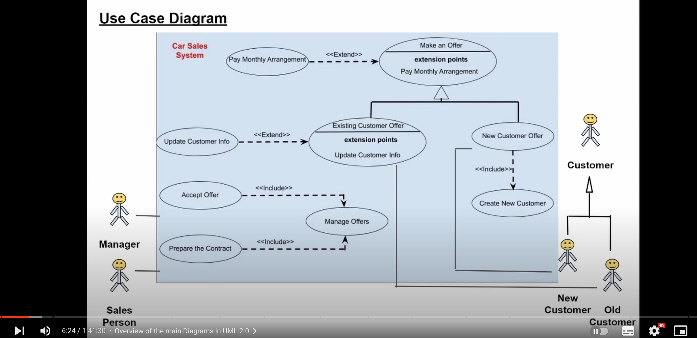

# UML

intergrated set of diagrams

uml can be divided in two main section

- Structural diagrams
- Behaviiral diagrams

## Class diagrams

theses diagrams are useful to represent class of objects and relationship between them

- relation are Associations (number...)
  - A person work for a company
- Inheretance ( -> )
- Aggregation ( ♢ )
  - form of composition

## Component diagram

## deployement diagram

## Object diagram

is an instance of the class diagram. it's more detailed and at a particular point in time

class is abstract whereas object diagram is more a snapshot

## Package diagram

Show packages and dependancy

## Composite structure diagram

similar to a class diagram but a type of component digram. it's used mainly in micro level modeling

## profile diagrams

todo

## Use case diagrams

functional requirement of a system, in term of use cases. In essence it is a model of intended functionality of the system

## Activity diagrams

todo

## state machine diagrams

## sequence diagrams

## communication diagrams

## interaction diagrams

## timing diagrams

##
